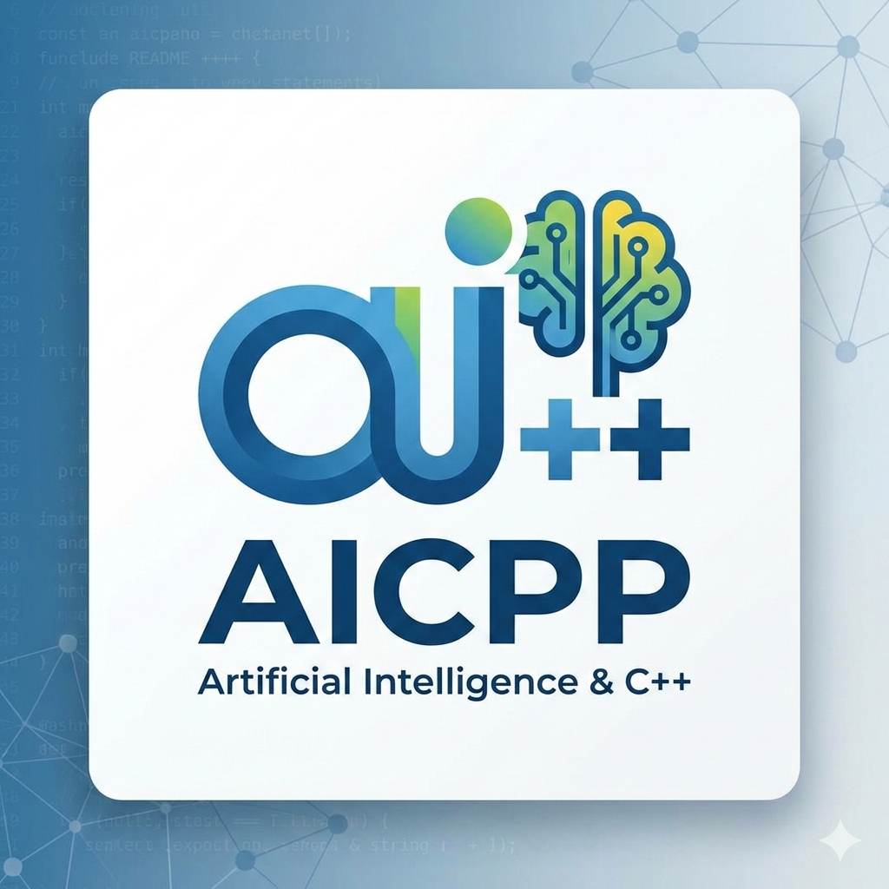

#  aicpp

[](https://github.com/Julien-Livet/aicpp/stargazers)
[](https://github.com/Julien-Livet/aicpp/issues)
[](https://arcprize.org)


**aicpp** is a deterministic symbolic program synthesis engine written in C++.

The goal is to explore a hybrid architecture that balances:

- Determinism
- Explicability
- Structural compositionality
- Native performance

[Concept of connected neural network.pdf](https://github.com/user-attachments/files/25365047/Concept.of.connected.neural.network.pdf)

---

## 🧠 Core Idea

A deterministic C++ engine:

- Composes typed primitives
- Explores bounded search depth
- Orders by cost
- Returns explicit symbolic solutions

C++ engine = deterministic solver

---

## ✨ Features

- ✔ Deterministic exhaustive symbolic exploration
- ✔ Strongly-typed neuron-based architecture
- ✔ Cost-based search ordering
- ✔ Dynamic C++ code generation and compilation
- ✔ JSON serialization of discovered structures
- ✔ Reusable structural memory
- ✔ Docker reproducibility

---

## 🚀 Quick Start

### Using Docker

```bash
git clone https://github.com/Julien-Livet/aicpp.git
cd aicpp
git clone https://github.com/arcprize/ARC-AGI-2.git
pip install -r requirements.txt
docker build -t aicpp .
docker run --rm aicpp
docker run --rm aicpp -c "time ./build/dsl_dataset 10 100"
cd scripts
git clone https://github.com/Julien-Livet/arc-dsl.git
python -m pytest --profile -sxv test_dsl_model.py
```

---

## 🏗 Architecture Overview

The system consists of:

1. Primitives (C++)
   - Typed transformation functions
2. Neuron
   - Wraps a primitive function
   - Defines input/output types
3. Connection
   - Composed graph of neurons
   - Brain
   - Manages search space
   - Performs cost-ordered exploration
   - Serializes discovered structures

## 🧪 Example (ARC Flip Task)

The engine then deterministically explores combinations and returns a symbolic solution such as:
`flipud(fliplr(I))`

No stochastic reasoning occurs in the solving phase.

---

## 📊 Why This Approach?

Traditional approaches:

- Deep learning → latent, non-explicit
- Program synthesis → combinatorial explosion
- LLM direct generation → non-deterministic

aicpp explores:
    deterministic symbolic exploration

This separation preserves:

- Reproducibility
- Inspectability
- Controlled search

## 📚 Documentation

- 📄 Research positioning: RESEARCH_POSITIONING.md
- 🗺 Roadmap: ROADMAP.md
- 🤝 Contribution guidelines: CONTRIBUTING.md
- 📘 Conceptual overview (PDF): see README links

---

## 🛠 Development

Minimum requirements:

- C++23
- Python 3.10
- Docker (recommended)

---

## 🔬 Research Perspective

aicpp is an experimental research framework exploring:

- Deterministic symbolic exploration
- Combinatorial reduction strategies

It is not a production ARC solver.

---

## 📈 Current Status

- Core engine operational
- ARC flip, color mapping, and segmentation tasks tested
- Structural memory implemented
- Docker reproducibility ensured
- Ongoing combinatorial optimization research

---

## 🤝 Contributing

Please read CONTRIBUTING.md before submitting pull requests.

We welcome contributions in:

- Primitive design
- Search pruning strategies
- Structural compression
- Performance optimization
- ARC benchmarking

---

## 📜 License

See LICENSE file.

---

## 🧠 Vision

The long-term goal is to build scalable, deterministic, and explicable hybrid reasoning systems.
