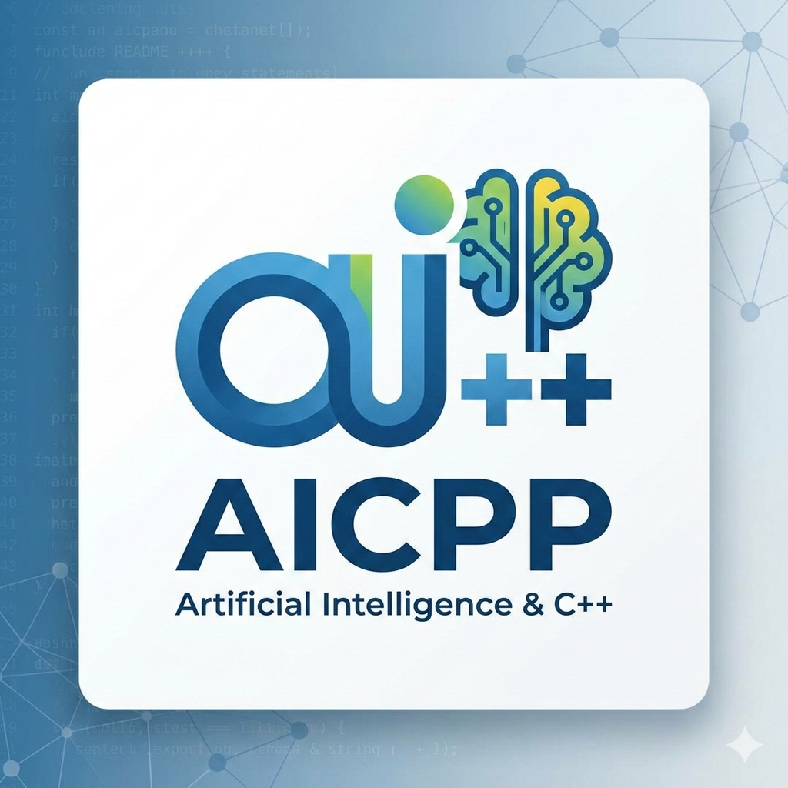

#  aicpp

[](https://github.com/Julien-Livet/aicpp/stargazers)
[](https://github.com/Julien-Livet/aicpp/issues)
[](https://arcprize.org/)


[](https://julien-livet.github.io/aicpp/assets/paper/nesy2027-livet.pdf)

**aicpp** is an experimental **neuro-symbolic program synthesis framework** written in C++ and Python.

The project investigates how learned neural representations can guide the search for **executable symbolic programs** in a constrained, typed Domain-Specific Language (DSL).

The primary experimental domain is the **ARC-AGI-2** benchmark.

---

## 🧠 Core Idea

Instead of directly predicting an answer, aicpp learns to navigate a symbolic program space.

The system combines:

* neural representations of ARC input/output grids;
* neural representations of candidate programs;
* representations of the outputs produced by candidate programs;
* progressive cost information;
* a Transformer-based program generator;
* a strongly typed executable DSL;
* deterministic symbolic execution;
* iterative cost-guided search.

The central loop is:

```text
ARC task
   │
   ▼
Neural representation
   │
   ▼
Candidate DSL programs
   │
   ▼
Symbolic execution
   │
   ▼
Output grids + costs
   │
   ▼
Neural representation
   │
   └──────────────► next candidates
```

In other words:

> **program → execution → consequences → representation → next program**

The long-term research question is whether a model can progressively learn **how to search a structured symbolic program space** from accumulated experience.

---

## 🏗 Architecture

A current aicpp search iteration can be summarized as follows:

```text
         ARC input/output pairs
                   │
                   ▼
           ┌──────────────┐
           │ Grid Encoder │
           │     CNN      │
           └──────┬───────┘
                  │
                  │
 Candidate        │        Candidate output grids
 programs         │                 │
    │             │                 │
    ▼             │                 ▼
┌─────────┐       │          ┌──────────────┐
│ Program │       │          │ Grid Encoder │
│ Encoder │       │          │     CNN      │
│   GNN   │       │          └──────┬───────┘
└────┬────┘       │                 │
     │            │                 │
     └────────────┼─────────────────┘
                  │
            Cost representation
                  │
                  ▼
          ┌────────────────┐
          │    Fusion      │
          └───────┬────────┘
                  │
                  ▼
          ┌────────────────┐
          │   Transformer  │
          │     Decoder    │
          └───────┬────────┘
                  │
             TreeState mask
                  │
                  ▼
            New DSL program
                  │
                  ▼
          Symbolic DSL engine
                  │
                  ▼
          Output grids + costs
                  │
                  └──────────► search pool
```

The symbolic engine provides the executable and constrained environment in which the neural model operates.

---

## 🔬 Neural-Guided Symbolic Search

During inference, aicpp starts from the identity program `I` and iteratively explores the program space.

A simplified search loop is:

1. Encode the current candidate programs and their accumulated information.
2. Generate new programs using beam search.
3. Execute the generated programs on the ARC examples.
4. Compute their costs.
5. Retain the most promising candidates.
6. Use the resulting experience to guide the next search iteration.
7. Stop when a zero-cost solution is found or the search budget is exhausted.

The current experimental configuration uses a beam width of 20 and retains the best 5 candidates between iterations.

The search frequently exhibits a **star-shaped exploration pattern**, with several program variants explored around promising candidates before moving toward another region of the search space.

---

## 🧩 Why a DSL?

The DSL provides an explicit interface between neural learning and symbolic execution.

It allows the system to:

* constrain the program search space;
* enforce structural and type constraints;
* generate executable candidates;
* evaluate candidates deterministically;
* compose reusable transformations;
* inspect and verify discovered programs;
* represent solutions explicitly rather than as opaque neural outputs.

For example, a solution can be represented as:

```text
hmirror(rot180(I))
```

rather than as an uninterpretable output tensor.

The DSL therefore acts as a **contract between the learned model and the symbolic execution engine**.

---

## 🧠 Learning the Program Space

One of the research directions explored in aicpp is whether training progressively organizes the model's representation of programs.

Thousands of generated DSL programs are embedded in the learned 256-dimensional representation space and analyzed using nearest-neighbor relationships and dimensionality-reduction methods such as t-SNE and UMAP.

Preliminary observations show non-trivial local organization associated with program structure and DSL primitives.

For example, depth-1 programs can form local regions corresponding to families such as:

```text
Scaling
 ├── upscale
 ├── hupscale
 ├── vupscale
 └── downscale

Geometric transformations
 ├── rot90
 ├── rot180
 ├── rot270
 ├── hmirror
 └── vmirror

Color transformations
 ├── replace
 └── switch

Reduction / extraction
 ├── trim
 ├── tophalf
 ├── bottomhalf
 └── ...
```

At greater program depths, the representation space also contains compositions of these primitives.

The current research question is whether this organization reflects only syntactic program structure or also **functional behavior and equivalence**.

---

## 🔄 Experience and Search

A central hypothesis of aicpp is that search experience can progressively become useful for future search.

The system therefore considers more than isolated program predictions:

```text
Search experience
       │
       ├── program
       ├── AST structure
       ├── embedding
       ├── output grids
       ├── cost
       └── provenance
              │
              ▼
       future search
```

This suggests a possible distinction between:

* **slow memory** — knowledge encoded in neural parameters;
* **fast memory** — previously explored programs and their associated representations, outputs and costs.

This experience-driven organization is an important direction for future versions of the system.

---

## 📊 ARC-AGI-2

aicpp is currently evaluated experimentally on **ARC-AGI-2**.

ARC provides a particularly useful research environment because it combines:

* small numbers of examples;
* abstract visual transformations;
* compositional reasoning;
* discrete solution spaces;
* executable symbolic representations;
* strong generalization requirements.

The objective is not merely to memorize ARC solutions, but to investigate whether learned representations can improve navigation through a constrained symbolic program space.

---

## 🧪 Research Questions

Current research questions include:

### Representation

Can neural representations capture useful structure in a symbolic program space?

### Search

Can learned representations improve the efficiency of discrete program search?

### Composition

Can the system combine previously learned primitives into useful programs that were not explicitly encountered during training?

### Behavioral organization

Do functionally equivalent programs become close in latent space even when their syntax differs?

### Experience

Can previously explored programs and their consequences be reused to reduce future search cost?

### Transfer

Can the same neural-guided symbolic search paradigm be transferred from ARC to other structured combinatorial problems?

---

## 🚀 Quick Start

### Using Docker

```bash
git clone -b dsl_engine https://github.com/Julien-Livet/aicpp.git
cd aicpp

git clone https://github.com/arcprize/ARC-AGI-2.git

pip install -r requirements.txt

docker build -t aicpp .
docker run --rm aicpp
```

To generate a symbolic DSL dataset:

```bash
docker run --rm aicpp -c "time ./build/dsl_dataset 10 100"
```

To run the Python tests:

```bash
cd scripts

git clone https://github.com/Julien-Livet/arc-dsl.git

python -m pytest --profile -sxv test_dsl_model.py
```

---

## ✨ Features

* ✔ Strongly typed symbolic DSL
* ✔ Deterministic symbolic execution
* ✔ Neural program representation using GNNs
* ✔ ARC grid representation using CNNs
* ✔ Transformer-based DSL program generation
* ✔ Tree-structured generation constraints
* ✔ Cost-guided iterative search
* ✔ Candidate program execution and verification
* ✔ Output-grid representations
* ✔ Program embedding and latent-space analysis
* ✔ Dynamic C++ code generation and compilation
* ✔ JSON serialization
* ✔ Reusable search experience
* ✔ Docker-based reproducibility
* ✔ C++23 implementation

---

## 🧱 Symbolic Engine

The underlying C++ engine provides the executable symbolic substrate of aicpp.

Its main abstractions include:

### Primitives

Typed transformation functions implemented in C++.

### Neurons

Wrappers around primitive functions defining input/output types.

### Connections

Compositions of neurons forming executable program structures.

### Brain

The symbolic search and structural management layer.

The symbolic engine is designed to remain deterministic and inspectable even when candidate generation is guided by a learned neural model.

---

## 📚 Documentation

* 📄 [Research positioning](RESEARCH_POSITIONING.md)
* 🗺 [Roadmap](ROADMAP.md)
* 🤝 [Contribution guidelines](CONTRIBUTING.md)
* 📘 [Research paper](https://julien-livet.github.io/aicpp/assets/paper/nesy2027-livet.pdf)
* 🌐 [Project website](https://julien-livet.github.io/aicpp/)

---

## 🛠 Development

Minimum requirements:

* C++23
* Python 3.10
* CUDA-capable GPU for neural training
* Docker (recommended)

The symbolic engine can also be used independently of the neural training pipeline.

---

## 🔬 Research Status

aicpp is an **experimental research framework**, not a production ARC solver.

The project currently investigates:

* neural-guided symbolic program synthesis;
* learned representations of executable program spaces;
* iterative cost-guided search;
* reuse of search experience;
* functional organization of program representations;
* transfer of the approach to structured combinatorial optimization.

Results should therefore be interpreted as research observations rather than as evidence of a general-purpose reasoning system.

---

## 🤝 Contributing

Contributions are welcome in:

* DSL primitive design
* program search
* search-space pruning
* neural representations
* program embeddings
* behavioral equivalence analysis
* performance optimization
* ARC-AGI benchmarking
* reproducibility
* industrial optimization applications

Please read [CONTRIBUTING.md](CONTRIBUTING.md) before submitting a pull request.

---

## 📜 License

See the [LICENSE](LICENSE) file.

---

## 🧠 Vision

The long-term goal of aicpp is to investigate a general paradigm for combining:

```text
Neural representations
        +
Symbolic constraints
        +
Executable programs
        +
Search
        +
Accumulated experience
```

The ambition is not simply to generate symbolic programs.

It is to investigate whether an AI system can **learn how to navigate a symbolic program space**.

ARC-AGI provides the current experimental laboratory.

PARME provides a possible industrial testbed.

The broader research direction is **neuro-symbolic search over executable structured spaces**.
