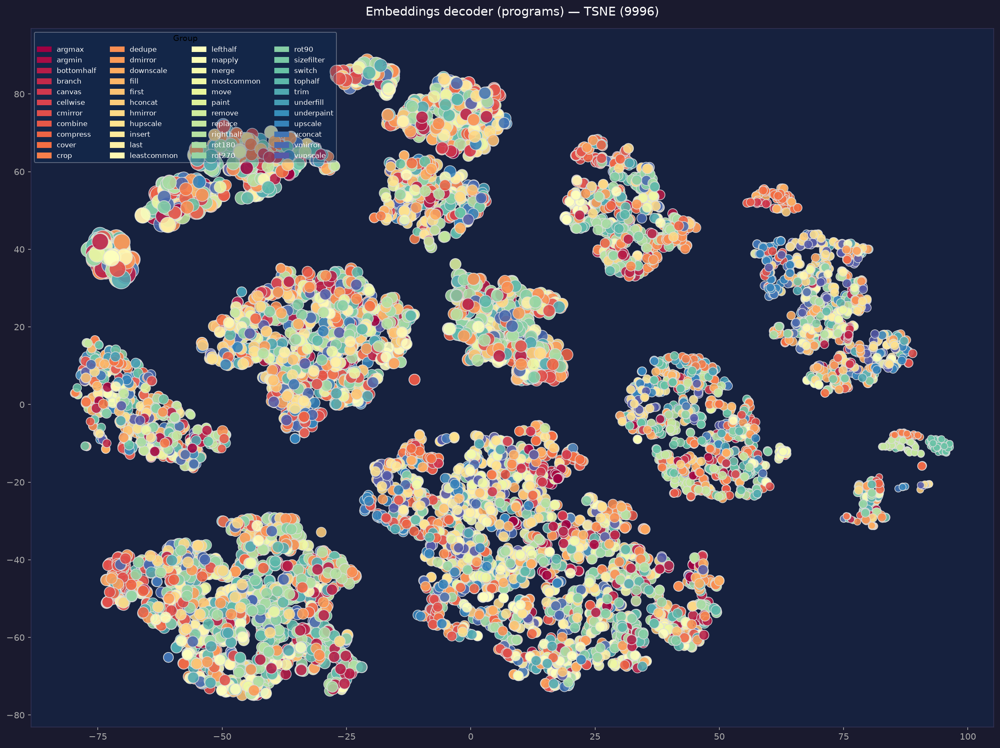
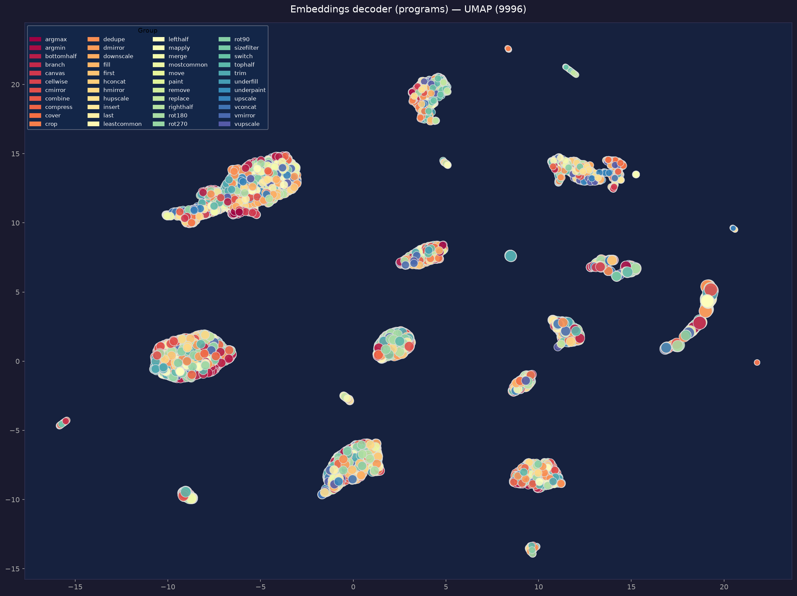

## Objective

aicpp contains a learned program encoder.

We investigate whether the resulting embedding space exhibits
structured organization beyond superficial syntactic similarity.

## Experimental setup

- 9,996 programs
- model trained on 100 programs
- embedding dimension: 256
- t-SNE
- UMAP

## t-SNE

## UMAP

## Preliminary observation

Both projections reveal multiple structured regions in the learned
program representation.

Programs sharing the same root primitive do not necessarily form
isolated clusters, suggesting that the representation may capture
structure beyond the root operation.

## Limitations

These visualizations alone do not establish semantic organization.

Future experiments will measure:

- syntax distance
- behavioral distance
- embedding distance
- clustering stability
- representation evolution during training
