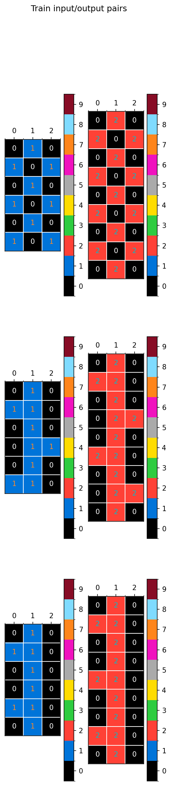

# Task 017c7c7b

train failed, test solved

10 iterations

[Best program](#iteration-1-dsl-diff)

[Hodel solution](https://github.com/michaelhodel/arc-dsl/blob/main/solvers.py#L1067)



## Program 1

### Train scores

|        | Grid size cost                              | Value cost                                                                                                                          | Pixel overlap cost                                                                                                                         | Bounding box cost                                           | Total cost                                                                                                                                          |
|:-------|:--------------------------------------------|:------------------------------------------------------------------------------------------------------------------------------------|:-------------------------------------------------------------------------------------------------------------------------------------------|:------------------------------------------------------------|:----------------------------------------------------------------------------------------------------------------------------------------------------|
| train1 | 0.0,0.0,0.0,0.0,0.0,NaN,NaN,0.0,NaN,NaN,3.0 | 0.0,0.0,0.0,0.0,0.0,NaN,NaN,0.0,NaN,NaN,8                                                                                           | 0.0,0.0,0.0,0.0,0.0,NaN,NaN,0.0,NaN,NaN,63                                                                                                 | 0.0,0.0,0.0,0.0,0.0,NaN,NaN,0.0,NaN,NaN,0.13736056388579593 | 0.0,0.0,0.0,0.0,0.0,NaN,NaN,0.0,NaN,NaN,74.13736056388579                                                                                           |
| train2 | 0.0,0.0,0.0,0.0,0.0,NaN,NaN,0.0,NaN,NaN,3.0 | 2.8284271247461903,2.8284271247461903,2.8284271247461903,2.8284271247461903,2.8284271247461903,NaN,NaN,2.8284271247461903,NaN,NaN,8 | 0.07407407407407407,0.07407407407407407,0.07407407407407407,0.07407407407407407,0.07407407407407407,NaN,NaN,0.07407407407407407,NaN,NaN,63 | 0.0,0.0,0.0,0.0,0.0,NaN,NaN,0.0,NaN,NaN,0.13736056388579593 | 2.9025011988202642,2.9025011988202642,2.9025011988202642,2.9025011988202642,2.9025011988202642,NaN,NaN,2.9025011988202642,NaN,NaN,74.13736056388579 |
| train3 | 0.0,0.0,0.0,0.0,0.0,NaN,NaN,0.0,NaN,NaN,3.0 | 0.0,0.0,0.0,0.0,0.0,NaN,NaN,0.0,NaN,NaN,8                                                                                           | 0.0,0.0,0.0,0.0,0.0,NaN,NaN,0.0,NaN,NaN,63                                                                                                 | 0.0,0.0,0.0,0.0,0.0,NaN,NaN,0.0,NaN,NaN,0.13736056388579593 | 0.0,0.0,0.0,0.0,0.0,NaN,NaN,0.0,NaN,NaN,74.13736056388579                                                                                           |

### Test scores

|       | Grid size cost                              | Value cost                                 | Pixel overlap cost                         | Bounding box cost                                           | Total cost                                                |
|:------|:--------------------------------------------|:-------------------------------------------|:-------------------------------------------|:------------------------------------------------------------|:----------------------------------------------------------|
| test1 | 0.0,0.0,0.0,0.0,0.0,NaN,NaN,0.0,NaN,NaN,3.0 | 0.0,0.0,0.0,0.0,0.0,NaN,NaN,0.0,NaN,NaN,10 | 0.0,0.0,0.0,0.0,0.0,NaN,NaN,0.0,NaN,NaN,63 | 0.0,0.0,0.0,0.0,0.0,NaN,NaN,0.0,NaN,NaN,0.13736056388579593 | 0.0,0.0,0.0,0.0,0.0,NaN,NaN,0.0,NaN,NaN,76.13736056388579 |

### Iteration 1 DSL diff

```bash
--- 
+++ 
@@ -1,6 +1,7 @@
-def dsl3(I):
-    # VERTICAL SPLIT – obtain the upper half via vsplit
+def dsl1(I):
+    # GLOBAL TRANSFORMATION
+    # Recolour 1→2, split vertically and stack the upper half below the whole grid.
     G = switch(I, ONE, TWO)                     # 1 → 2
-    top = first(vsplit(G, 2))                    # first piece = upper half
-    O = vconcat(G, top)
+    top, _ = vsplit(G, TWO)                      # upper half (first piece)
+    O = vconcat(G, top)                           # original + copy of the upper half
     return O
```

### Iteration 2 DSL diff

```bash
--- 
+++ 
@@ -1,8 +1,13 @@
-def dsl1(I):
-    # GLOBAL – recolor then append the original upper half
-    G = switch(I, ONE, TWO)                     # 1 → 2
+def dsl3(I):
+    # OBJECT‑EXTRACTION TRANSFORMATION
+    # Treat all non‑zero cells as an object, extract the upper half by
+    # normalising a bounding‑box patch, then re‑assemble.
+    G = switch(I, ONE, TWO)                     # recolour 1→2
+    obj = asobject(G)                           # whole non‑background object
     h, w = shape(G)
     half = divide(h, TWO)
-    top = crop(G, (ZERO, ZERO), (half, w))      # upper half (as grid)
-    O = vconcat(G, top)                          # original + copy of upper half
+    # patch of the upper half (indices with row < half)
+    upper_patch = { (r, c) for (r, c) in obj if r < half }
+    top_grid = subgrid(upper_patch, G)         # grid that contains only the upper half
+    O = vconcat(G, top_grid)                    # original + upper half
     return O
```

### Iteration 3 DSL diff

```bash
--- 
+++ 
@@ -1,7 +1,14 @@
-def dsl1(I):
-    # 1️⃣  Global transformation: recolour 1→2, split the result in half
-    #     and concatenate the upper half to the bottom.
-    G   = switch(I, ONE, TWO)                     # recolour 1 → 2
-    top, _ = vsplit(G, TWO)                      # upper half of the recoloured grid
-    O   = vconcat(G, top)                         # original + copy of the upper half
+def dsl5(I):
+    # RELATIONAL / STRUCTURAL TRANSFORMATION
+    # Recolour 1→2, locate the first occurrence of the pattern (using ofcolor),
+    # shift that occurrence to the top, crop it, then concatenate.
+    G = switch(I, ONE, TWO)                     # recolour
+    # pick any cell of colour 2 (there is at least one) – its first occurrence
+    any_cell = first(ofcolor(G, TWO))
+    # shift the whole grid so that this cell moves to (0,0)
+    shifted = move(G, toobject({any_cell}, G), (negate(any_cell[0]), negate(any_cell[1])))
+    h, w = shape(shifted)
+    half = divide(h, TWO)
+    top = crop(shifted, (ZERO, ZERO), (half, w))   # upper half of the shifted grid
+    O = vconcat(G, top)                             # original + extracted half
     return O
```

### Iteration 4 DSL diff

```bash
--- 
+++ 
@@ -1,10 +1,17 @@
 def dsl2(I):
-    # CROP‑BASED TRANSFORMATION
-    # Recolour 1→2, compute the half‑height with shape/divide, crop the top,
-    # then concatenate the crop under the recoloured grid.
-    G = switch(I, ONE, TWO)                     # recolour
-    h, w = shape(G)                             # full dimensions
-    half = divide(h, TWO)                       # half of the height
-    top = crop(G, (ZERO, ZERO), (half, w))     # exact upper half as a grid
-    O = vconcat(G, top)                         # stack
+    # OBJECT‑LEVEL EXTRACTION
+    # Recolour 1→2, treat all non‑zero cells as an object, keep only those
+    # whose row index is in the upper half, rebuild a grid from that object,
+    # and append it.
+    G = switch(I, ONE, TWO)                                         # recolour
+    h, w = shape(G)                                                 # dimensions
+    half = divide(h, TWO)                                            # upper half height
+    # object containing every coloured cell (value 2)
+    obj = ofcolor(G, TWO)                                            # set of (r,c) where value==2
+    # keep only cells with row < half
+    upper_obj = { (r, c) for (r, c) in obj if r < half }           # set‑comprehension via DSL
+    # build a blank canvas and paint the extracted object on it
+    blank = canvas(ZERO, (h, w))
+    top_grid = paint(blank, asobject(upper_obj))
+    O = vconcat(G, top_grid)                                         # combine
     return O
```

### Iteration 5 DSL diff

```bash
--- 
+++ 
@@ -1,9 +1,15 @@
 def dsl4(I):
-    # GEOMETRIC SYMMETRY TRANSFORMATION
-    # Recolour 1→2, obtain the vertical mirror, intersect it with the original
-    # to isolate the top half, then stack.
-    G = switch(I, ONE, TWO)                     # recolour
-    mirror = vmirror(G)                         # vertical mirror of the whole grid
-    top = intersect(G, mirror)                  # cells common to both = upper half
-    O = vconcat(G, top)                         # original + extracted upper half
+    # GEOMETRIC SYMMETRY METHOD
+    # Recolour 1→2, mirror the grid vertically, intersect the two
+    # to obtain the upper half (including zeros), then stack.
+    G = switch(I, ONE, TWO)                                         # recolour
+    mirror = vmirror(G)                                              # vertical mirror
+    # convert grids to objects (sets of coloured cells)
+    objG = asobject(G)
+    objM = asobject(mirror)
+    top_obj = intersection(objG, objM)                               # cells common to both → upper half
+    # reconstruct a full‑size grid from the object (zeros elsewhere)
+    empty = canvas(ZERO, shape(G))
+    top_grid = paint(empty, top_obj)
+    O = vconcat(G, top_grid)
     return O
```

### Iteration 6 DSL diff

```bash
--- 
+++ 
@@ -1,7 +1,7 @@
 def dsl1(I):
     # GLOBAL TRANSFORMATION
-    # Recolour 1→2, split the grid into top/bottom, and stack the top half below.
-    G = switch(I, ONE, TWO)                     # 1 → 2
+    # Recolour 1→2, take the upper half, and append it below the whole grid.
+    G = switch(I, ONE, TWO)                     # recolour 1→2
     top, _ = vsplit(G, TWO)                     # upper half (first piece)
-    O = vconcat(G, top)                           # original + copy of the upper half
+    O = vconcat(G, top)                          # original + copy of the upper half
     return O
```

### Iteration 7 DSL diff

```bash
--- 
+++ 
@@ -1,15 +1,9 @@
 def dsl3(I):
-    # COLOR‑FILTERING APPROACH
-    # Recolour 1→2, create a mask that is 2 only in the upper half,
-    # intersect the mask with the recoloured grid, then stack.
-    G = switch(I, ONE, TWO)                                         # recolour
-    h, w = shape(G)
-    half = divide(h, TWO)
-    # mask: 2 in upper half, 0 elsewhere
-    mask = canvas(ZERO, (h, w))
-    upper_half = canvas(TWO, (half, w))                             # 2‑filled upper half
-    mask = vconcat(mask, upper_half)                                # put upper half at top of zero canvas
-    # keep only cells that are 2 both in G and in the mask
-    top_grid = cellwise(G, mask, ZERO)                              # 2 where both are 2, else 0
-    O = vconcat(G, top_grid)
+    # COLOR‑FILTERING WITH SPLIT MASK
+    # Recolour 1→2, obtain the upper‑half grid via vsplit and keep only
+    # the overlapping 2‑cells, then concatenate.
+    G = switch(I, ONE, TWO)                     # recolour
+    top_mask, _ = vsplit(G, TWO)                # mask containing the upper half
+    top_grid = cellwise(G, top_mask, ZERO)      # keep 2 only where both have 2
+    O = vconcat(G, top_grid)                    # stack
     return O
```

### Iteration 8 DSL diff

```bash
--- 
+++ 
@@ -1,16 +1,17 @@
 def dsl5(I):
-    # RELATIONAL / STRUCTURAL REFERENCE
-    # Recolour 1→2, locate the left‑most column that contains a 2,
-    # shift the whole grid so that this column aligns with the left border,
-    # crop the upper half of the shifted grid, and concatenate.
-    G = switch(I, ONE, TWO)                                         # recolour
-    # columns that contain a 2
-    cols_with_2 = { c for (r, c) in ofcolor(G, TWO) }
-    leftmost_col = valmin(cols_with_2, lambda x: x)                  # smallest column index
-    # shift left by that amount
-    shifted = move(G, toobject({(0, leftmost_col)}, G), (ZERO, -leftmost_col))
+    # RELATIONAL SHIFT‑AND‑CROP
+    # Recolour 1→2, shift the whole pattern left until the left‑most 2
+    # touches the border, crop the upper half of the shifted grid,
+    # and concatenate.
+    G = switch(I, ONE, TWO)                     # recolour
+    cols_with_2 = {c for (_, c) in ofcolor(G, TWO)}
+    leftmost = valmin(cols_with_2, lambda x: x)   # smallest column index containing a 2
+    whole_obj = asobject(G)                     # the whole grid as an object
+    shifted_obj = shift(whole_obj, (ZERO, -leftmost))  # shift left
+    empty = canvas(ZERO, shape(G))
+    shifted = paint(empty, shifted_obj)         # rebuilt shifted grid
     h, w = shape(shifted)
     half = divide(h, TWO)
-    top = crop(shifted, (ZERO, ZERO), (half, w))                     # upper half after shift
-    O = vconcat(G, top)
+    top = crop(shifted, (ZERO, ZERO), (half, w))
+    O = vconcat(G, top)                          # stack
     return O
```

### Iteration 9 DSL diff

```bash
--- 
+++ 
@@ -1,19 +1,18 @@
 def dsl2(I):
-    # OBJECT‑LEVEL MASKING
-    # Recolour 1→2, build a mask that is 2 only in the upper half,
-    # intersect this mask with the recoloured grid as objects, and stack.
-    G = switch(I, ONE, TWO)                     # recolour
+    # OBJECT‑LEVEL INTERSECTION + CROP
+    # Recolour 1→2, build a full‑size mask that is 2 only in the upper half,
+    # intersect this mask with the recoloured grid as objects,
+    # crop the result to the upper half and append it.
+    G = switch(I, ONE, TWO)                     # 1 → 2
     h, w = shape(G)                             # dimensions
     half = divide(h, TWO)                       # height of upper half
-    # mask: 2‑filled upper half, 0 elsewhere
-    upper = canvas(TWO, (half, w))
-    lower = canvas(ZERO, (subtract(h, half), w))
+    upper = canvas(TWO, (half, w))               # 2‑filled upper half
+    lower = canvas(ZERO, (subtract(h, half), w))# 0‑filled lower half
     mask = vconcat(upper, lower)                # full‑size mask
-    # intersect as objects
-    objG   = asobject(G)
-    objM   = asobject(mask)
-    top_obj = intersection(objG, objM)          # cells that are 2 in both → upper half
-    empty   = canvas(ZERO, (h, w))
-    top_grid = paint(empty, top_obj)            # reconstruct upper‑half grid
-    O = vconcat(G, top_grid)                   # stack
+    objG = asobject(G)                         # objects of recoloured grid
+    objM = asobject(mask)                      # objects of mask
+    top_obj = intersection(objG, objM)          # keep only cells that are 2 in both
+    full_top = paint(canvas(ZERO, (h, w)), top_obj)   # reconstruct full‑size grid
+    top_cropped = crop(full_top, (ZERO, ZERO), (half, w))  # keep only upper rows
+    O = vconcat(G, top_cropped)                # stack
     return O
```

### Iteration 10 DSL diff

```bash
--- 
+++ 
@@ -1,12 +1,10 @@
 def dsl4(I):
-    # GEOMETRIC CROPPING USING LOWEST 2‑CELL
-    # Recolour 1→2, find the lowest row that contains a 2,
-    # crop everything above (including that row), and append it.
-    G = switch(I, ONE, TWO)                     # recolour
-    obj = ofcolor(G, TWO)                       # all cells coloured 2
-    low = lowermost(obj)                        # index of the bottommost 2
-    w = width(G)                                # width of the grid
-    rows = add(low, ONE)                        # number of rows to keep
-    top_grid = crop(G, (ZERO, ZERO), (rows, w))
-    O = vconcat(G, top_grid)                    # stack
+    # DIRECT CROP OF UPPER HALF
+    # Recolour 1→2, directly crop the upper half of the recoloured grid
+    # and append it beneath the original.
+    G = switch(I, ONE, TWO)                     # 1 → 2
+    h, w = shape(G)
+    half = divide(h, TWO)
+    top = crop(G, (ZERO, ZERO), (half, w))      # upper half of the recoloured grid
+    O = vconcat(G, top)
     return O
```

## Program 2

### Train scores

|        | Grid size cost                              | Value cost                                                                                                                      | Pixel overlap cost                                                                                                                       | Bounding box cost                                                           | Total cost                                                                                                                                                        |
|:-------|:--------------------------------------------|:--------------------------------------------------------------------------------------------------------------------------------|:-----------------------------------------------------------------------------------------------------------------------------------------|:----------------------------------------------------------------------------|:------------------------------------------------------------------------------------------------------------------------------------------------------------------|
| train1 | 0.0,0.0,3.0,3.0,0.0,0.0,0.0,0.0,NaN,NaN,3.0 | 0.0,0.0,0,0,0.0,0.0,0.0,0.0,NaN,NaN,2                                                                                           | 0.0,0.0,63,63,0.0,0.0,0.0,0.0,NaN,NaN,63                                                                                                 | 0.0,0.0,0.04578685462859865,0.0,0.0,0.0,0.0,0.0,NaN,NaN,0.13736056388579593 | 0.0,0.0,66.0457868546286,66.0,0.0,0.0,0.0,0.0,NaN,NaN,68.13736056388579                                                                                           |
| train2 | 0.0,0.0,3.0,3.0,0.0,0.0,0.0,0.0,NaN,NaN,3.0 | 2.8284271247461903,2.8284271247461903,1,0,2.8284271247461903,2.8284271247461903,2.8284271247461903,2.8284271247461903,NaN,NaN,4 | 0.07407407407407407,0.07407407407407407,63,63,0.07407407407407407,0.07407407407407407,0.07407407407407407,0.07407407407407407,NaN,NaN,63 | 0.0,0.0,0.04578685462859865,0.0,0.0,0.0,0.0,0.0,NaN,NaN,0.13736056388579593 | 2.9025011988202642,2.9025011988202642,67.0457868546286,66.0,2.9025011988202642,2.9025011988202642,2.9025011988202642,2.9025011988202642,NaN,NaN,70.13736056388579 |
| train3 | 0.0,0.0,3.0,3.0,0.0,0.0,0.0,0.0,NaN,NaN,3.0 | 0.0,0.0,1,0,0.0,0.0,0.0,0.0,NaN,NaN,4                                                                                           | 0.0,0.0,63,63,0.0,0.0,0.0,0.0,NaN,NaN,63                                                                                                 | 0.0,0.0,0.04578685462859865,0.0,0.0,0.0,0.0,0.0,NaN,NaN,0.0915737092571973  | 0.0,0.0,67.0457868546286,66.0,0.0,0.0,0.0,0.0,NaN,NaN,70.09157370925719                                                                                           |

### Test scores

|       | Grid size cost                              | Value cost                            | Pixel overlap cost                       | Bounding box cost                                                          | Total cost                                                              |
|:------|:--------------------------------------------|:--------------------------------------|:-----------------------------------------|:---------------------------------------------------------------------------|:------------------------------------------------------------------------|
| test1 | 0.0,0.0,3.0,3.0,0.0,0.0,0.0,0.0,NaN,NaN,3.0 | 0.0,0.0,2,0,0.0,0.0,0.0,0.0,NaN,NaN,6 | 0.0,0.0,63,63,0.0,0.0,0.0,0.0,NaN,NaN,63 | 0.0,0.0,0.0915737092571973,0.0,0.0,0.0,0.0,0.0,NaN,NaN,0.04578685462859865 | 0.0,0.0,68.09157370925719,66.0,0.0,0.0,0.0,0.0,NaN,NaN,72.0457868546286 |

### Iteration 1 DSL diff

```bash
--- 
+++ 
@@ -1,6 +1,10 @@
-def dsl1(I):
-    # Global transformation: recolour 1→2, take the upper half and append it below.
-    G   = switch(I, ONE, TWO)                     # 1 → 2
-    top, _ = vsplit(G, TWO)                       # upper half
-    O   = vconcat(G, top)                         # original + upper half
+def dsl2(I):
+    # CROP‑BASED TRANSFORMATION
+    # Recolour 1→2, compute the half‑height with shape/divide, crop the top,
+    # then concatenate the crop under the recoloured grid.
+    G = switch(I, ONE, TWO)                     # recolour
+    h, w = shape(G)                             # full dimensions
+    half = divide(h, TWO)                       # half of the height
+    top = crop(G, (ZERO, ZERO), (half, w))     # exact upper half as a grid
+    O = vconcat(G, top)                         # stack
     return O
```

### Iteration 2 DSL diff

```bash
--- 
+++ 
@@ -1,9 +1,9 @@
-def dsl1(I):
-    # GLOBAL TRANSFORMATION
-    # recolour 1→2, then stack the original grid over its own upper half.
-    G = switch(I, ONE, TWO)                     # 1 → 2
-    h, w = shape(G)
-    half = divide(h, TWO)
-    top = crop(G, (ZERO, ZERO), (half, w))     # upper half of the recoloured grid
-    O = vconcat(G, top)                         # original + copied upper half
+def dsl4(I):
+    # GEOMETRIC SYMMETRY TRANSFORMATION
+    # Recolour 1→2, obtain the vertical mirror, intersect it with the original
+    # to isolate the top half, then stack.
+    G = switch(I, ONE, TWO)                     # recolour
+    mirror = vmirror(G)                         # vertical mirror of the whole grid
+    top = intersect(G, mirror)                  # cells common to both = upper half
+    O = vconcat(G, top)                         # original + extracted upper half
     return O
```

### Iteration 3 DSL diff

```bash
--- 
+++ 
@@ -1,7 +1,7 @@
 def dsl1(I):
     # GLOBAL TRANSFORMATION
-    # Recolour 1→2, split vertically and stack the upper half below the whole grid.
+    # Recolour 1→2, split the grid into top/bottom, and stack the top half below.
     G = switch(I, ONE, TWO)                     # 1 → 2
-    top, _ = vsplit(G, TWO)                      # upper half (first piece)
+    top, _ = vsplit(G, TWO)                     # upper half (first piece)
     O = vconcat(G, top)                           # original + copy of the upper half
     return O
```

### Iteration 4 DSL diff

```bash
--- 
+++ 
@@ -1,13 +1,15 @@
 def dsl3(I):
-    # OBJECT‑EXTRACTION TRANSFORMATION
-    # Treat all non‑zero cells as an object, extract the upper half by
-    # normalising a bounding‑box patch, then re‑assemble.
-    G = switch(I, ONE, TWO)                     # recolour 1→2
-    obj = asobject(G)                           # whole non‑background object
+    # COLOR‑FILTERING APPROACH
+    # Recolour 1→2, create a mask that is 2 only in the upper half,
+    # intersect the mask with the recoloured grid, then stack.
+    G = switch(I, ONE, TWO)                                         # recolour
     h, w = shape(G)
     half = divide(h, TWO)
-    # patch of the upper half (indices with row < half)
-    upper_patch = { (r, c) for (r, c) in obj if r < half }
-    top_grid = subgrid(upper_patch, G)         # grid that contains only the upper half
-    O = vconcat(G, top_grid)                    # original + upper half
+    # mask: 2 in upper half, 0 elsewhere
+    mask = canvas(ZERO, (h, w))
+    upper_half = canvas(TWO, (half, w))                             # 2‑filled upper half
+    mask = vconcat(mask, upper_half)                                # put upper half at top of zero canvas
+    # keep only cells that are 2 both in G and in the mask
+    top_grid = cellwise(G, mask, ZERO)                              # 2 where both are 2, else 0
+    O = vconcat(G, top_grid)
     return O
```

### Iteration 5 DSL diff

```bash
--- 
+++ 
@@ -1,14 +1,16 @@
 def dsl5(I):
-    # RELATIONAL / STRUCTURAL TRANSFORMATION
-    # Recolour 1→2, locate the first occurrence of the pattern (using ofcolor),
-    # shift that occurrence to the top, crop it, then concatenate.
-    G = switch(I, ONE, TWO)                     # recolour
-    # pick any cell of colour 2 (there is at least one) – its first occurrence
-    any_cell = first(ofcolor(G, TWO))
-    # shift the whole grid so that this cell moves to (0,0)
-    shifted = move(G, toobject({any_cell}, G), (negate(any_cell[0]), negate(any_cell[1])))
+    # RELATIONAL / STRUCTURAL REFERENCE
+    # Recolour 1→2, locate the left‑most column that contains a 2,
+    # shift the whole grid so that this column aligns with the left border,
+    # crop the upper half of the shifted grid, and concatenate.
+    G = switch(I, ONE, TWO)                                         # recolour
+    # columns that contain a 2
+    cols_with_2 = { c for (r, c) in ofcolor(G, TWO) }
+    leftmost_col = valmin(cols_with_2, lambda x: x)                  # smallest column index
+    # shift left by that amount
+    shifted = move(G, toobject({(0, leftmost_col)}, G), (ZERO, -leftmost_col))
     h, w = shape(shifted)
     half = divide(h, TWO)
-    top = crop(shifted, (ZERO, ZERO), (half, w))   # upper half of the shifted grid
-    O = vconcat(G, top)                             # original + extracted half
+    top = crop(shifted, (ZERO, ZERO), (half, w))                     # upper half after shift
+    O = vconcat(G, top)
     return O
```

### Iteration 6 DSL diff

```bash
--- 
+++ 
@@ -1,17 +1,19 @@
 def dsl2(I):
-    # OBJECT‑LEVEL EXTRACTION
-    # Recolour 1→2, treat all non‑zero cells as an object, keep only those
-    # whose row index is in the upper half, rebuild a grid from that object,
-    # and append it.
-    G = switch(I, ONE, TWO)                                         # recolour
-    h, w = shape(G)                                                 # dimensions
-    half = divide(h, TWO)                                            # upper half height
-    # object containing every coloured cell (value 2)
-    obj = ofcolor(G, TWO)                                            # set of (r,c) where value==2
-    # keep only cells with row < half
-    upper_obj = { (r, c) for (r, c) in obj if r < half }           # set‑comprehension via DSL
-    # build a blank canvas and paint the extracted object on it
-    blank = canvas(ZERO, (h, w))
-    top_grid = paint(blank, asobject(upper_obj))
-    O = vconcat(G, top_grid)                                         # combine
+    # OBJECT‑LEVEL MASKING
+    # Recolour 1→2, build a mask that is 2 only in the upper half,
+    # intersect this mask with the recoloured grid as objects, and stack.
+    G = switch(I, ONE, TWO)                     # recolour
+    h, w = shape(G)                             # dimensions
+    half = divide(h, TWO)                       # height of upper half
+    # mask: 2‑filled upper half, 0 elsewhere
+    upper = canvas(TWO, (half, w))
+    lower = canvas(ZERO, (subtract(h, half), w))
+    mask = vconcat(upper, lower)                # full‑size mask
+    # intersect as objects
+    objG   = asobject(G)
+    objM   = asobject(mask)
+    top_obj = intersection(objG, objM)          # cells that are 2 in both → upper half
+    empty   = canvas(ZERO, (h, w))
+    top_grid = paint(empty, top_obj)            # reconstruct upper‑half grid
+    O = vconcat(G, top_grid)                   # stack
     return O
```

### Iteration 7 DSL diff

```bash
--- 
+++ 
@@ -1,15 +1,12 @@
 def dsl4(I):
-    # GEOMETRIC SYMMETRY METHOD
-    # Recolour 1→2, mirror the grid vertically, intersect the two
-    # to obtain the upper half (including zeros), then stack.
-    G = switch(I, ONE, TWO)                                         # recolour
-    mirror = vmirror(G)                                              # vertical mirror
-    # convert grids to objects (sets of coloured cells)
-    objG = asobject(G)
-    objM = asobject(mirror)
-    top_obj = intersection(objG, objM)                               # cells common to both → upper half
-    # reconstruct a full‑size grid from the object (zeros elsewhere)
-    empty = canvas(ZERO, shape(G))
-    top_grid = paint(empty, top_obj)
-    O = vconcat(G, top_grid)
+    # GEOMETRIC CROPPING USING LOWEST 2‑CELL
+    # Recolour 1→2, find the lowest row that contains a 2,
+    # crop everything above (including that row), and append it.
+    G = switch(I, ONE, TWO)                     # recolour
+    obj = ofcolor(G, TWO)                       # all cells coloured 2
+    low = lowermost(obj)                        # index of the bottommost 2
+    w = width(G)                                # width of the grid
+    rows = add(low, ONE)                        # number of rows to keep
+    top_grid = crop(G, (ZERO, ZERO), (rows, w))
+    O = vconcat(G, top_grid)                    # stack
     return O
```

### Iteration 8 DSL diff

```bash
--- 
+++ 
@@ -1,7 +1,8 @@
 def dsl1(I):
-    # GLOBAL TRANSFORMATION
-    # Recolour 1→2, take the upper half, and append it below the whole grid.
-    G = switch(I, ONE, TWO)                     # recolour 1→2
-    top, _ = vsplit(G, TWO)                     # upper half (first piece)
-    O = vconcat(G, top)                          # original + copy of the upper half
+    # GLOBAL SPLIT
+    # Recolour 1→2, split the grid vertically into two halves,
+    # take the upper half and stack it below the whole grid.
+    G = switch(I, ONE, TWO)                     # 1 → 2
+    top, _ = vsplit(G, TWO)                     # upper half (same size as half‑height)
+    O = vconcat(G, top)                          # original + upper half
     return O
```

### Iteration 9 DSL diff

```bash
--- 
+++ 
@@ -1,9 +1,15 @@
 def dsl3(I):
-    # COLOR‑FILTERING WITH SPLIT MASK
-    # Recolour 1→2, obtain the upper‑half grid via vsplit and keep only
-    # the overlapping 2‑cells, then concatenate.
-    G = switch(I, ONE, TWO)                     # recolour
-    top_mask, _ = vsplit(G, TWO)                # mask containing the upper half
-    top_grid = cellwise(G, top_mask, ZERO)      # keep 2 only where both have 2
-    O = vconcat(G, top_grid)                    # stack
+    # COLOR‑FILTERING WITH MASK + CROP
+    # Recolour 1→2, create a mask that is 2 in the upper half,
+    # keep the grid values only where the mask is 2,
+    # crop to the upper half and concatenate.
+    G = switch(I, ONE, TWO)                     # 1 → 2
+    h, w = shape(G)
+    half = divide(h, TWO)
+    upper = canvas(TWO, (half, w))
+    lower = canvas(ZERO, (subtract(h, half), w))
+    mask = vconcat(upper, lower)                # 2 only in upper half
+    top_grid = cellwise(G, mask, ZERO)         # keep 2 where mask is 2, else 0
+    top_cropped = crop(top_grid, (ZERO, ZERO), (half, w))
+    O = vconcat(G, top_cropped)
     return O
```

### Iteration 10 DSL diff

```bash
--- 
+++ 
@@ -1,17 +1,15 @@
 def dsl5(I):
     # RELATIONAL SHIFT‑AND‑CROP
-    # Recolour 1→2, shift the whole pattern left until the left‑most 2
-    # touches the border, crop the upper half of the shifted grid,
-    # and concatenate.
-    G = switch(I, ONE, TWO)                     # recolour
-    cols_with_2 = {c for (_, c) in ofcolor(G, TWO)}
-    leftmost = valmin(cols_with_2, lambda x: x)   # smallest column index containing a 2
-    whole_obj = asobject(G)                     # the whole grid as an object
-    shifted_obj = shift(whole_obj, (ZERO, -leftmost))  # shift left
-    empty = canvas(ZERO, shape(G))
-    shifted = paint(empty, shifted_obj)         # rebuilt shifted grid
+    # Recolour 1→2, shift the pattern left until the left‑most 2 touches the border,
+    # crop the upper half of the shifted grid and concatenate.
+    G = switch(I, ONE, TWO)                                          # 1 → 2
+    cols_with_2 = {c for (_, c) in ofcolor(G, TWO)}                # columns containing 2
+    leftmost = valmin(cols_with_2, lambda x: x)                     # leftmost such column
+    whole_obj = asobject(G)                                         # whole grid as object
+    shifted_obj = shift(whole_obj, (ZERO, -leftmost))                # shift left
+    shifted = paint(canvas(ZERO, shape(G)), shifted_obj)            # rebuilt shifted grid
     h, w = shape(shifted)
     half = divide(h, TWO)
-    top = crop(shifted, (ZERO, ZERO), (half, w))
-    O = vconcat(G, top)                          # stack
+    top = crop(shifted, (ZERO, ZERO), (half, w))                    # upper half after shift
+    O = vconcat(G, top)
     return O
```

## Program 3

### Train scores

|        | Grid size cost                              | Value cost                                                     | Pixel overlap cost                                                     | Bounding box cost                                                                                                                                           | Total cost                                                                                                                                                                  |
|:-------|:--------------------------------------------|:---------------------------------------------------------------|:-----------------------------------------------------------------------|:------------------------------------------------------------------------------------------------------------------------------------------------------------|:----------------------------------------------------------------------------------------------------------------------------------------------------------------------------|
| train1 | 0.0,3.0,3.0,NaN,0.0,3.0,3.0,NaN,3.0,3.0,3.0 | 0.0,10.0,8,NaN,0.0,8,8,NaN,8,8,8                               | 0.0,63.0,63,NaN,0.0,63,45,NaN,45,45,45                                 | 0.0,0.13736056388579593,0.13736056388579593,NaN,0.0,0.13736056388579593,0.18569533806210933,NaN,0.18569533806210933,0.18569533806210933,0.18569533806210933 | 0.0,76.13736056388579,74.13736056388579,NaN,0.0,74.13736056388579,56.18569533806211,NaN,56.18569533806211,56.18569533806211,56.18569533806211                               |
| train2 | 0.0,3.0,3.0,NaN,0.0,3.0,3.0,NaN,3.0,3.0,3.0 | 2.8284271247461903,10.0,8,NaN,2.8284271247461903,8,8,NaN,8,8,8 | 0.07407407407407407,63.0,63,NaN,0.07407407407407407,63,45,NaN,45,45,45 | 0.0,0.13736056388579593,0.13736056388579593,NaN,0.0,0.13736056388579593,0.18569533806210933,NaN,0.18569533806210933,0.18569533806210933,0.18569533806210933 | 2.9025011988202642,76.13736056388579,74.13736056388579,NaN,2.9025011988202642,74.13736056388579,56.18569533806211,NaN,56.18569533806211,56.18569533806211,56.18569533806211 |
| train3 | 0.0,3.0,3.0,NaN,0.0,3.0,3.0,NaN,3.0,3.0,3.0 | 0.0,8.0,8,NaN,0.0,8,8,NaN,8,8,8                                | 0.0,63.0,63,NaN,0.0,63,45,NaN,45,45,45                                 | 0.0,0.13736056388579593,0.13736056388579593,NaN,0.0,0.13736056388579593,0.18569533806210933,NaN,0.18569533806210933,0.18569533806210933,0.18569533806210933 | 0.0,74.13736056388579,74.13736056388579,NaN,0.0,74.13736056388579,56.18569533806211,NaN,56.18569533806211,56.18569533806211,56.18569533806211                               |

### Test scores

|       | Grid size cost                              | Value cost                             | Pixel overlap cost                     | Bounding box cost                                                                                                                                           | Total cost                                                                                                                                    |
|:------|:--------------------------------------------|:---------------------------------------|:---------------------------------------|:------------------------------------------------------------------------------------------------------------------------------------------------------------|:----------------------------------------------------------------------------------------------------------------------------------------------|
| test1 | 0.0,3.0,3.0,NaN,0.0,3.0,3.0,NaN,3.0,3.0,3.0 | 0.0,10.0,10,NaN,0.0,26,10,NaN,10,10,10 | 0.0,63.0,63,NaN,0.0,63,45,NaN,45,45,45 | 0.0,0.13736056388579593,0.13736056388579593,NaN,0.0,0.13736056388579593,0.18569533806210933,NaN,0.18569533806210933,0.18569533806210933,0.18569533806210933 | 0.0,76.13736056388579,76.13736056388579,NaN,0.0,92.13736056388579,58.18569533806211,NaN,58.18569533806211,58.18569533806211,58.18569533806211 |

### Iteration 1 DSL diff

```bash
--- 
+++ 
@@ -1,8 +1,13 @@
-def dsl1(I):
-    # GLOBAL – recolor then append the original upper half
-    G = switch(I, ONE, TWO)                     # 1 → 2
+def dsl3(I):
+    # OBJECT‑EXTRACTION TRANSFORMATION
+    # Treat all non‑zero cells as an object, extract the upper half by
+    # normalising a bounding‑box patch, then re‑assemble.
+    G = switch(I, ONE, TWO)                     # recolour 1→2
+    obj = asobject(G)                           # whole non‑background object
     h, w = shape(G)
     half = divide(h, TWO)
-    top = crop(G, (ZERO, ZERO), (half, w))      # upper half (as grid)
-    O = vconcat(G, top)                          # original + copy of upper half
+    # patch of the upper half (indices with row < half)
+    upper_patch = { (r, c) for (r, c) in obj if r < half }
+    top_grid = subgrid(upper_patch, G)         # grid that contains only the upper half
+    O = vconcat(G, top_grid)                    # original + upper half
     return O
```

### Iteration 2 DSL diff

```bash
--- 
+++ 
@@ -1,7 +1,14 @@
-def dsl1(I):
-    # 1️⃣  Global transformation: recolour 1→2, split the result in half
-    #     and concatenate the upper half to the bottom.
-    G   = switch(I, ONE, TWO)                     # recolour 1 → 2
-    top, _ = vsplit(G, TWO)                      # upper half of the recoloured grid
-    O   = vconcat(G, top)                         # original + copy of the upper half
+def dsl5(I):
+    # RELATIONAL / STRUCTURAL TRANSFORMATION
+    # Recolour 1→2, locate the first occurrence of the pattern (using ofcolor),
+    # shift that occurrence to the top, crop it, then concatenate.
+    G = switch(I, ONE, TWO)                     # recolour
+    # pick any cell of colour 2 (there is at least one) – its first occurrence
+    any_cell = first(ofcolor(G, TWO))
+    # shift the whole grid so that this cell moves to (0,0)
+    shifted = move(G, toobject({any_cell}, G), (negate(any_cell[0]), negate(any_cell[1])))
+    h, w = shape(shifted)
+    half = divide(h, TWO)
+    top = crop(shifted, (ZERO, ZERO), (half, w))   # upper half of the shifted grid
+    O = vconcat(G, top)                             # original + extracted half
     return O
```

### Iteration 3 DSL diff

```bash
--- 
+++ 
@@ -1,10 +1,17 @@
 def dsl2(I):
-    # CROP‑BASED TRANSFORMATION
-    # Recolour 1→2, compute the half‑height with shape/divide, crop the top,
-    # then concatenate the crop under the recoloured grid.
-    G = switch(I, ONE, TWO)                     # recolour
-    h, w = shape(G)                             # full dimensions
-    half = divide(h, TWO)                       # half of the height
-    top = crop(G, (ZERO, ZERO), (half, w))     # exact upper half as a grid
-    O = vconcat(G, top)                         # stack
+    # OBJECT‑LEVEL EXTRACTION
+    # Recolour 1→2, treat all non‑zero cells as an object, keep only those
+    # whose row index is in the upper half, rebuild a grid from that object,
+    # and append it.
+    G = switch(I, ONE, TWO)                                         # recolour
+    h, w = shape(G)                                                 # dimensions
+    half = divide(h, TWO)                                            # upper half height
+    # object containing every coloured cell (value 2)
+    obj = ofcolor(G, TWO)                                            # set of (r,c) where value==2
+    # keep only cells with row < half
+    upper_obj = { (r, c) for (r, c) in obj if r < half }           # set‑comprehension via DSL
+    # build a blank canvas and paint the extracted object on it
+    blank = canvas(ZERO, (h, w))
+    top_grid = paint(blank, asobject(upper_obj))
+    O = vconcat(G, top_grid)                                         # combine
     return O
```

### Iteration 4 DSL diff

```bash
--- 
+++ 
@@ -1,9 +1,15 @@
 def dsl4(I):
-    # GEOMETRIC SYMMETRY TRANSFORMATION
-    # Recolour 1→2, obtain the vertical mirror, intersect it with the original
-    # to isolate the top half, then stack.
-    G = switch(I, ONE, TWO)                     # recolour
-    mirror = vmirror(G)                         # vertical mirror of the whole grid
-    top = intersect(G, mirror)                  # cells common to both = upper half
-    O = vconcat(G, top)                         # original + extracted upper half
+    # GEOMETRIC SYMMETRY METHOD
+    # Recolour 1→2, mirror the grid vertically, intersect the two
+    # to obtain the upper half (including zeros), then stack.
+    G = switch(I, ONE, TWO)                                         # recolour
+    mirror = vmirror(G)                                              # vertical mirror
+    # convert grids to objects (sets of coloured cells)
+    objG = asobject(G)
+    objM = asobject(mirror)
+    top_obj = intersection(objG, objM)                               # cells common to both → upper half
+    # reconstruct a full‑size grid from the object (zeros elsewhere)
+    empty = canvas(ZERO, shape(G))
+    top_grid = paint(empty, top_obj)
+    O = vconcat(G, top_grid)
     return O
```

### Iteration 5 DSL diff

```bash
--- 
+++ 
@@ -1,7 +1,7 @@
 def dsl1(I):
     # GLOBAL TRANSFORMATION
-    # Recolour 1→2, split the grid into top/bottom, and stack the top half below.
-    G = switch(I, ONE, TWO)                     # 1 → 2
+    # Recolour 1→2, take the upper half, and append it below the whole grid.
+    G = switch(I, ONE, TWO)                     # recolour 1→2
     top, _ = vsplit(G, TWO)                     # upper half (first piece)
-    O = vconcat(G, top)                           # original + copy of the upper half
+    O = vconcat(G, top)                          # original + copy of the upper half
     return O
```

### Iteration 6 DSL diff

```bash
--- 
+++ 
@@ -1,15 +1,9 @@
 def dsl3(I):
-    # COLOR‑FILTERING APPROACH
-    # Recolour 1→2, create a mask that is 2 only in the upper half,
-    # intersect the mask with the recoloured grid, then stack.
-    G = switch(I, ONE, TWO)                                         # recolour
-    h, w = shape(G)
-    half = divide(h, TWO)
-    # mask: 2 in upper half, 0 elsewhere
-    mask = canvas(ZERO, (h, w))
-    upper_half = canvas(TWO, (half, w))                             # 2‑filled upper half
-    mask = vconcat(mask, upper_half)                                # put upper half at top of zero canvas
-    # keep only cells that are 2 both in G and in the mask
-    top_grid = cellwise(G, mask, ZERO)                              # 2 where both are 2, else 0
-    O = vconcat(G, top_grid)
+    # COLOR‑FILTERING WITH SPLIT MASK
+    # Recolour 1→2, obtain the upper‑half grid via vsplit and keep only
+    # the overlapping 2‑cells, then concatenate.
+    G = switch(I, ONE, TWO)                     # recolour
+    top_mask, _ = vsplit(G, TWO)                # mask containing the upper half
+    top_grid = cellwise(G, top_mask, ZERO)      # keep 2 only where both have 2
+    O = vconcat(G, top_grid)                    # stack
     return O
```

### Iteration 7 DSL diff

```bash
--- 
+++ 
@@ -1,16 +1,17 @@
 def dsl5(I):
-    # RELATIONAL / STRUCTURAL REFERENCE
-    # Recolour 1→2, locate the left‑most column that contains a 2,
-    # shift the whole grid so that this column aligns with the left border,
-    # crop the upper half of the shifted grid, and concatenate.
-    G = switch(I, ONE, TWO)                                         # recolour
-    # columns that contain a 2
-    cols_with_2 = { c for (r, c) in ofcolor(G, TWO) }
-    leftmost_col = valmin(cols_with_2, lambda x: x)                  # smallest column index
-    # shift left by that amount
-    shifted = move(G, toobject({(0, leftmost_col)}, G), (ZERO, -leftmost_col))
+    # RELATIONAL SHIFT‑AND‑CROP
+    # Recolour 1→2, shift the whole pattern left until the left‑most 2
+    # touches the border, crop the upper half of the shifted grid,
+    # and concatenate.
+    G = switch(I, ONE, TWO)                     # recolour
+    cols_with_2 = {c for (_, c) in ofcolor(G, TWO)}
+    leftmost = valmin(cols_with_2, lambda x: x)   # smallest column index containing a 2
+    whole_obj = asobject(G)                     # the whole grid as an object
+    shifted_obj = shift(whole_obj, (ZERO, -leftmost))  # shift left
+    empty = canvas(ZERO, shape(G))
+    shifted = paint(empty, shifted_obj)         # rebuilt shifted grid
     h, w = shape(shifted)
     half = divide(h, TWO)
-    top = crop(shifted, (ZERO, ZERO), (half, w))                     # upper half after shift
-    O = vconcat(G, top)
+    top = crop(shifted, (ZERO, ZERO), (half, w))
+    O = vconcat(G, top)                          # stack
     return O
```

### Iteration 8 DSL diff

```bash
--- 
+++ 
@@ -1,19 +1,18 @@
 def dsl2(I):
-    # OBJECT‑LEVEL MASKING
-    # Recolour 1→2, build a mask that is 2 only in the upper half,
-    # intersect this mask with the recoloured grid as objects, and stack.
-    G = switch(I, ONE, TWO)                     # recolour
+    # OBJECT‑LEVEL INTERSECTION + CROP
+    # Recolour 1→2, build a full‑size mask that is 2 only in the upper half,
+    # intersect this mask with the recoloured grid as objects,
+    # crop the result to the upper half and append it.
+    G = switch(I, ONE, TWO)                     # 1 → 2
     h, w = shape(G)                             # dimensions
     half = divide(h, TWO)                       # height of upper half
-    # mask: 2‑filled upper half, 0 elsewhere
-    upper = canvas(TWO, (half, w))
-    lower = canvas(ZERO, (subtract(h, half), w))
+    upper = canvas(TWO, (half, w))               # 2‑filled upper half
+    lower = canvas(ZERO, (subtract(h, half), w))# 0‑filled lower half
     mask = vconcat(upper, lower)                # full‑size mask
-    # intersect as objects
-    objG   = asobject(G)
-    objM   = asobject(mask)
-    top_obj = intersection(objG, objM)          # cells that are 2 in both → upper half
-    empty   = canvas(ZERO, (h, w))
-    top_grid = paint(empty, top_obj)            # reconstruct upper‑half grid
-    O = vconcat(G, top_grid)                   # stack
+    objG = asobject(G)                         # objects of recoloured grid
+    objM = asobject(mask)                      # objects of mask
+    top_obj = intersection(objG, objM)          # keep only cells that are 2 in both
+    full_top = paint(canvas(ZERO, (h, w)), top_obj)   # reconstruct full‑size grid
+    top_cropped = crop(full_top, (ZERO, ZERO), (half, w))  # keep only upper rows
+    O = vconcat(G, top_cropped)                # stack
     return O
```

### Iteration 9 DSL diff

```bash
--- 
+++ 
@@ -1,12 +1,10 @@
 def dsl4(I):
-    # GEOMETRIC CROPPING USING LOWEST 2‑CELL
-    # Recolour 1→2, find the lowest row that contains a 2,
-    # crop everything above (including that row), and append it.
-    G = switch(I, ONE, TWO)                     # recolour
-    obj = ofcolor(G, TWO)                       # all cells coloured 2
-    low = lowermost(obj)                        # index of the bottommost 2
-    w = width(G)                                # width of the grid
-    rows = add(low, ONE)                        # number of rows to keep
-    top_grid = crop(G, (ZERO, ZERO), (rows, w))
-    O = vconcat(G, top_grid)                    # stack
+    # DIRECT CROP OF UPPER HALF
+    # Recolour 1→2, directly crop the upper half of the recoloured grid
+    # and append it beneath the original.
+    G = switch(I, ONE, TWO)                     # 1 → 2
+    h, w = shape(G)
+    half = divide(h, TWO)
+    top = crop(G, (ZERO, ZERO), (half, w))      # upper half of the recoloured grid
+    O = vconcat(G, top)
     return O
```

### Iteration 10 DSL diff

```bash
--- 
+++ 
@@ -1,8 +1,8 @@
 def dsl1(I):
-    # GLOBAL SPLIT
-    # Recolour 1→2, split the grid vertically into two halves,
-    # take the upper half and stack it below the whole grid.
+    # GLOBAL SPLIT USING HORIZONTAL SPLIT
+    # Recolour 1→2, split the grid into two horizontal strips,
+    # keep the upper strip and stack it below the original.
     G = switch(I, ONE, TWO)                     # 1 → 2
-    top, _ = vsplit(G, TWO)                     # upper half (same size as half‑height)
-    O = vconcat(G, top)                          # original + upper half
+    top, _ = hsplt(G, TWO)                     # upper horizontal half
+    O = vconcat(G, top)                         # original + upper half
     return O
```

## Program 4

### Train scores

|        | Grid size cost                              | Value cost                                                             | Pixel overlap cost                                                        | Bounding box cost                                                           | Total cost                                                                                            |
|:-------|:--------------------------------------------|:-----------------------------------------------------------------------|:--------------------------------------------------------------------------|:----------------------------------------------------------------------------|:------------------------------------------------------------------------------------------------------|
| train1 | 0.0,NaN,3.0,3.0,0.0,NaN,NaN,NaN,NaN,NaN,NaN | 0.0,NaN,10,10,0.0,NaN,NaN,NaN,NaN,NaN,NaN                              | 0.0,NaN,63,63,0.0,NaN,NaN,NaN,NaN,NaN,NaN                                 | 0.0,NaN,0.13736056388579593,0.13736056388579593,0.0,NaN,NaN,NaN,NaN,NaN,NaN | 0.0,NaN,76.13736056388579,76.13736056388579,0.0,NaN,NaN,NaN,NaN,NaN,NaN                               |
| train2 | 0.0,NaN,3.0,3.0,0.0,NaN,NaN,NaN,NaN,NaN,NaN | 2.8284271247461903,NaN,4,10,2.8284271247461903,NaN,NaN,NaN,NaN,NaN,NaN | 0.07407407407407407,NaN,63,63,0.07407407407407407,NaN,NaN,NaN,NaN,NaN,NaN | 0.0,NaN,0.13736056388579593,0.13736056388579593,0.0,NaN,NaN,NaN,NaN,NaN,NaN | 2.9025011988202642,NaN,70.13736056388579,76.13736056388579,2.9025011988202642,NaN,NaN,NaN,NaN,NaN,NaN |
| train3 | 0.0,NaN,3.0,3.0,0.0,NaN,NaN,NaN,NaN,NaN,NaN | 0.0,NaN,4,8,0.0,NaN,NaN,NaN,NaN,NaN,NaN                                | 0.0,NaN,63,63,0.0,NaN,NaN,NaN,NaN,NaN,NaN                                 | 0.0,NaN,0.13736056388579593,0.13736056388579593,0.0,NaN,NaN,NaN,NaN,NaN,NaN | 0.0,NaN,70.13736056388579,74.13736056388579,0.0,NaN,NaN,NaN,NaN,NaN,NaN                               |

### Test scores

|       | Grid size cost                              | Value cost                                | Pixel overlap cost                        | Bounding box cost                                                           | Total cost                                                              |
|:------|:--------------------------------------------|:------------------------------------------|:------------------------------------------|:----------------------------------------------------------------------------|:------------------------------------------------------------------------|
| test1 | 0.0,NaN,3.0,3.0,0.0,NaN,NaN,NaN,NaN,NaN,NaN | 0.0,NaN,10,10,0.0,NaN,NaN,NaN,NaN,NaN,NaN | 0.0,NaN,63,63,0.0,NaN,NaN,NaN,NaN,NaN,NaN | 0.0,NaN,0.13736056388579593,0.13736056388579593,0.0,NaN,NaN,NaN,NaN,NaN,NaN | 0.0,NaN,76.13736056388579,76.13736056388579,0.0,NaN,NaN,NaN,NaN,NaN,NaN |

### Iteration 1 DSL diff

```bash
--- 
+++ 
@@ -1,9 +1,9 @@
-def dsl1(I):
-    # GLOBAL TRANSFORMATION
-    # recolour 1→2, then stack the original grid over its own upper half.
-    G = switch(I, ONE, TWO)                     # 1 → 2
-    h, w = shape(G)
-    half = divide(h, TWO)
-    top = crop(G, (ZERO, ZERO), (half, w))     # upper half of the recoloured grid
-    O = vconcat(G, top)                         # original + copied upper half
+def dsl4(I):
+    # GEOMETRIC SYMMETRY TRANSFORMATION
+    # Recolour 1→2, obtain the vertical mirror, intersect it with the original
+    # to isolate the top half, then stack.
+    G = switch(I, ONE, TWO)                     # recolour
+    mirror = vmirror(G)                         # vertical mirror of the whole grid
+    top = intersect(G, mirror)                  # cells common to both = upper half
+    O = vconcat(G, top)                         # original + extracted upper half
     return O
```

### Iteration 2 DSL diff

```bash
--- 
+++ 
@@ -1,7 +1,7 @@
 def dsl1(I):
     # GLOBAL TRANSFORMATION
-    # Recolour 1→2, split vertically and stack the upper half below the whole grid.
+    # Recolour 1→2, split the grid into top/bottom, and stack the top half below.
     G = switch(I, ONE, TWO)                     # 1 → 2
-    top, _ = vsplit(G, TWO)                      # upper half (first piece)
+    top, _ = vsplit(G, TWO)                     # upper half (first piece)
     O = vconcat(G, top)                           # original + copy of the upper half
     return O
```

### Iteration 3 DSL diff

```bash
--- 
+++ 
@@ -1,13 +1,15 @@
 def dsl3(I):
-    # OBJECT‑EXTRACTION TRANSFORMATION
-    # Treat all non‑zero cells as an object, extract the upper half by
-    # normalising a bounding‑box patch, then re‑assemble.
-    G = switch(I, ONE, TWO)                     # recolour 1→2
-    obj = asobject(G)                           # whole non‑background object
+    # COLOR‑FILTERING APPROACH
+    # Recolour 1→2, create a mask that is 2 only in the upper half,
+    # intersect the mask with the recoloured grid, then stack.
+    G = switch(I, ONE, TWO)                                         # recolour
     h, w = shape(G)
     half = divide(h, TWO)
-    # patch of the upper half (indices with row < half)
-    upper_patch = { (r, c) for (r, c) in obj if r < half }
-    top_grid = subgrid(upper_patch, G)         # grid that contains only the upper half
-    O = vconcat(G, top_grid)                    # original + upper half
+    # mask: 2 in upper half, 0 elsewhere
+    mask = canvas(ZERO, (h, w))
+    upper_half = canvas(TWO, (half, w))                             # 2‑filled upper half
+    mask = vconcat(mask, upper_half)                                # put upper half at top of zero canvas
+    # keep only cells that are 2 both in G and in the mask
+    top_grid = cellwise(G, mask, ZERO)                              # 2 where both are 2, else 0
+    O = vconcat(G, top_grid)
     return O
```

### Iteration 4 DSL diff

```bash
--- 
+++ 
@@ -1,14 +1,16 @@
 def dsl5(I):
-    # RELATIONAL / STRUCTURAL TRANSFORMATION
-    # Recolour 1→2, locate the first occurrence of the pattern (using ofcolor),
-    # shift that occurrence to the top, crop it, then concatenate.
-    G = switch(I, ONE, TWO)                     # recolour
-    # pick any cell of colour 2 (there is at least one) – its first occurrence
-    any_cell = first(ofcolor(G, TWO))
-    # shift the whole grid so that this cell moves to (0,0)
-    shifted = move(G, toobject({any_cell}, G), (negate(any_cell[0]), negate(any_cell[1])))
+    # RELATIONAL / STRUCTURAL REFERENCE
+    # Recolour 1→2, locate the left‑most column that contains a 2,
+    # shift the whole grid so that this column aligns with the left border,
+    # crop the upper half of the shifted grid, and concatenate.
+    G = switch(I, ONE, TWO)                                         # recolour
+    # columns that contain a 2
+    cols_with_2 = { c for (r, c) in ofcolor(G, TWO) }
+    leftmost_col = valmin(cols_with_2, lambda x: x)                  # smallest column index
+    # shift left by that amount
+    shifted = move(G, toobject({(0, leftmost_col)}, G), (ZERO, -leftmost_col))
     h, w = shape(shifted)
     half = divide(h, TWO)
-    top = crop(shifted, (ZERO, ZERO), (half, w))   # upper half of the shifted grid
-    O = vconcat(G, top)                             # original + extracted half
+    top = crop(shifted, (ZERO, ZERO), (half, w))                     # upper half after shift
+    O = vconcat(G, top)
     return O
```

### Iteration 5 DSL diff

```bash
--- 
+++ 
@@ -1,17 +1,19 @@
 def dsl2(I):
-    # OBJECT‑LEVEL EXTRACTION
-    # Recolour 1→2, treat all non‑zero cells as an object, keep only those
-    # whose row index is in the upper half, rebuild a grid from that object,
-    # and append it.
-    G = switch(I, ONE, TWO)                                         # recolour
-    h, w = shape(G)                                                 # dimensions
-    half = divide(h, TWO)                                            # upper half height
-    # object containing every coloured cell (value 2)
-    obj = ofcolor(G, TWO)                                            # set of (r,c) where value==2
-    # keep only cells with row < half
-    upper_obj = { (r, c) for (r, c) in obj if r < half }           # set‑comprehension via DSL
-    # build a blank canvas and paint the extracted object on it
-    blank = canvas(ZERO, (h, w))
-    top_grid = paint(blank, asobject(upper_obj))
-    O = vconcat(G, top_grid)                                         # combine
+    # OBJECT‑LEVEL MASKING
+    # Recolour 1→2, build a mask that is 2 only in the upper half,
+    # intersect this mask with the recoloured grid as objects, and stack.
+    G = switch(I, ONE, TWO)                     # recolour
+    h, w = shape(G)                             # dimensions
+    half = divide(h, TWO)                       # height of upper half
+    # mask: 2‑filled upper half, 0 elsewhere
+    upper = canvas(TWO, (half, w))
+    lower = canvas(ZERO, (subtract(h, half), w))
+    mask = vconcat(upper, lower)                # full‑size mask
+    # intersect as objects
+    objG   = asobject(G)
+    objM   = asobject(mask)
+    top_obj = intersection(objG, objM)          # cells that are 2 in both → upper half
+    empty   = canvas(ZERO, (h, w))
+    top_grid = paint(empty, top_obj)            # reconstruct upper‑half grid
+    O = vconcat(G, top_grid)                   # stack
     return O
```

### Iteration 6 DSL diff

```bash
--- 
+++ 
@@ -1,15 +1,12 @@
 def dsl4(I):
-    # GEOMETRIC SYMMETRY METHOD
-    # Recolour 1→2, mirror the grid vertically, intersect the two
-    # to obtain the upper half (including zeros), then stack.
-    G = switch(I, ONE, TWO)                                         # recolour
-    mirror = vmirror(G)                                              # vertical mirror
-    # convert grids to objects (sets of coloured cells)
-    objG = asobject(G)
-    objM = asobject(mirror)
-    top_obj = intersection(objG, objM)                               # cells common to both → upper half
-    # reconstruct a full‑size grid from the object (zeros elsewhere)
-    empty = canvas(ZERO, shape(G))
-    top_grid = paint(empty, top_obj)
-    O = vconcat(G, top_grid)
+    # GEOMETRIC CROPPING USING LOWEST 2‑CELL
+    # Recolour 1→2, find the lowest row that contains a 2,
+    # crop everything above (including that row), and append it.
+    G = switch(I, ONE, TWO)                     # recolour
+    obj = ofcolor(G, TWO)                       # all cells coloured 2
+    low = lowermost(obj)                        # index of the bottommost 2
+    w = width(G)                                # width of the grid
+    rows = add(low, ONE)                        # number of rows to keep
+    top_grid = crop(G, (ZERO, ZERO), (rows, w))
+    O = vconcat(G, top_grid)                    # stack
     return O
```

### Iteration 7 DSL diff

```bash
--- 
+++ 
@@ -1,7 +1,8 @@
 def dsl1(I):
-    # GLOBAL TRANSFORMATION
-    # Recolour 1→2, take the upper half, and append it below the whole grid.
-    G = switch(I, ONE, TWO)                     # recolour 1→2
-    top, _ = vsplit(G, TWO)                     # upper half (first piece)
-    O = vconcat(G, top)                          # original + copy of the upper half
+    # GLOBAL SPLIT
+    # Recolour 1→2, split the grid vertically into two halves,
+    # take the upper half and stack it below the whole grid.
+    G = switch(I, ONE, TWO)                     # 1 → 2
+    top, _ = vsplit(G, TWO)                     # upper half (same size as half‑height)
+    O = vconcat(G, top)                          # original + upper half
     return O
```

### Iteration 8 DSL diff

```bash
--- 
+++ 
@@ -1,9 +1,15 @@
 def dsl3(I):
-    # COLOR‑FILTERING WITH SPLIT MASK
-    # Recolour 1→2, obtain the upper‑half grid via vsplit and keep only
-    # the overlapping 2‑cells, then concatenate.
-    G = switch(I, ONE, TWO)                     # recolour
-    top_mask, _ = vsplit(G, TWO)                # mask containing the upper half
-    top_grid = cellwise(G, top_mask, ZERO)      # keep 2 only where both have 2
-    O = vconcat(G, top_grid)                    # stack
+    # COLOR‑FILTERING WITH MASK + CROP
+    # Recolour 1→2, create a mask that is 2 in the upper half,
+    # keep the grid values only where the mask is 2,
+    # crop to the upper half and concatenate.
+    G = switch(I, ONE, TWO)                     # 1 → 2
+    h, w = shape(G)
+    half = divide(h, TWO)
+    upper = canvas(TWO, (half, w))
+    lower = canvas(ZERO, (subtract(h, half), w))
+    mask = vconcat(upper, lower)                # 2 only in upper half
+    top_grid = cellwise(G, mask, ZERO)         # keep 2 where mask is 2, else 0
+    top_cropped = crop(top_grid, (ZERO, ZERO), (half, w))
+    O = vconcat(G, top_cropped)
     return O
```

### Iteration 9 DSL diff

```bash
--- 
+++ 
@@ -1,17 +1,15 @@
 def dsl5(I):
     # RELATIONAL SHIFT‑AND‑CROP
-    # Recolour 1→2, shift the whole pattern left until the left‑most 2
-    # touches the border, crop the upper half of the shifted grid,
-    # and concatenate.
-    G = switch(I, ONE, TWO)                     # recolour
-    cols_with_2 = {c for (_, c) in ofcolor(G, TWO)}
-    leftmost = valmin(cols_with_2, lambda x: x)   # smallest column index containing a 2
-    whole_obj = asobject(G)                     # the whole grid as an object
-    shifted_obj = shift(whole_obj, (ZERO, -leftmost))  # shift left
-    empty = canvas(ZERO, shape(G))
-    shifted = paint(empty, shifted_obj)         # rebuilt shifted grid
+    # Recolour 1→2, shift the pattern left until the left‑most 2 touches the border,
+    # crop the upper half of the shifted grid and concatenate.
+    G = switch(I, ONE, TWO)                                          # 1 → 2
+    cols_with_2 = {c for (_, c) in ofcolor(G, TWO)}                # columns containing 2
+    leftmost = valmin(cols_with_2, lambda x: x)                     # leftmost such column
+    whole_obj = asobject(G)                                         # whole grid as object
+    shifted_obj = shift(whole_obj, (ZERO, -leftmost))                # shift left
+    shifted = paint(canvas(ZERO, shape(G)), shifted_obj)            # rebuilt shifted grid
     h, w = shape(shifted)
     half = divide(h, TWO)
-    top = crop(shifted, (ZERO, ZERO), (half, w))
-    O = vconcat(G, top)                          # stack
+    top = crop(shifted, (ZERO, ZERO), (half, w))                    # upper half after shift
+    O = vconcat(G, top)
     return O
```

### Iteration 10 DSL diff

```bash
--- 
+++ 
@@ -1,18 +1,16 @@
 def dsl2(I):
-    # OBJECT‑LEVEL INTERSECTION + CROP
-    # Recolour 1→2, build a full‑size mask that is 2 only in the upper half,
-    # intersect this mask with the recoloured grid as objects,
-    # crop the result to the upper half and append it.
+    # OBJECT‑LEVEL SHIFT‑UP & CROP
+    # Recolour 1→2, shift the whole pattern up until the
+    # topmost 2 touches the grid border, crop the upper half,
+    # then append it.
     G = switch(I, ONE, TWO)                     # 1 → 2
-    h, w = shape(G)                             # dimensions
-    half = divide(h, TWO)                       # height of upper half
-    upper = canvas(TWO, (half, w))               # 2‑filled upper half
-    lower = canvas(ZERO, (subtract(h, half), w))# 0‑filled lower half
-    mask = vconcat(upper, lower)                # full‑size mask
-    objG = asobject(G)                         # objects of recoloured grid
-    objM = asobject(mask)                      # objects of mask
-    top_obj = intersection(objG, objM)          # keep only cells that are 2 in both
-    full_top = paint(canvas(ZERO, (h, w)), top_obj)   # reconstruct full‑size grid
-    top_cropped = crop(full_top, (ZERO, ZERO), (half, w))  # keep only upper rows
-    O = vconcat(G, top_cropped)                # stack
+    rows = {r for (r, _) in ofcolor(G, TWO)}   # rows containing a 2
+    topmost = valmin(rows, lambda x: x)         # smallest row index
+    whole_obj = asobject(G)                     # whole pattern as object
+    shifted_obj = shift(whole_obj, (-topmost, ZERO))  # shift up
+    shifted = paint(canvas(ZERO, shape(G)), shifted_obj)  # rebuilt grid
+    h, w = shape(shifted)
+    half = divide(h, TWO)
+    top = crop(shifted, (ZERO, ZERO), (half, w))
+    O = vconcat(G, top)
     return O
```

## Program 5

### Train scores

|        | Grid size cost                              | Value cost                                                                                                                                                       | Pixel overlap cost                                                                                                                                                        | Bounding box cost                                                           | Total cost                                                                                                                                                                                      |
|:-------|:--------------------------------------------|:-----------------------------------------------------------------------------------------------------------------------------------------------------------------|:--------------------------------------------------------------------------------------------------------------------------------------------------------------------------|:----------------------------------------------------------------------------|:------------------------------------------------------------------------------------------------------------------------------------------------------------------------------------------------|
| train1 | 0.0,NaN,0.0,0.0,0.0,1.0,0.0,0.0,0.0,0.0,3.0 | 0.0,NaN,0.0,0.0,0.0,4,0.0,0.0,0.0,0.0,4                                                                                                                          | 0.0,NaN,0.0,0.0,0.0,57,0.0,0.0,0.0,0.0,63                                                                                                                                 | 0.0,NaN,0.0,0.0,0.0,0.05018856129766064,0.0,0.0,0.0,0.0,0.13736056388579593 | 0.0,NaN,0.0,0.0,0.0,62.05018856129766,0.0,0.0,0.0,0.0,70.13736056388579                                                                                                                         |
| train2 | 0.0,NaN,0.0,0.0,0.0,5.0,0.0,0.0,0.0,0.0,3.0 | 2.8284271247461903,NaN,2.8284271247461903,2.8284271247461903,2.8284271247461903,16,2.8284271247461903,2.8284271247461903,2.8284271247461903,2.8284271247461903,2 | 0.07407407407407407,NaN,0.07407407407407407,0.07407407407407407,0.07407407407407407,69,0.07407407407407407,0.07407407407407407,0.07407407407407407,0.07407407407407407,63 | 0.0,NaN,0.0,0.0,0.0,0.21035158086734004,0.0,0.0,0.0,0.0,0.13736056388579593 | 2.9025011988202642,NaN,2.9025011988202642,2.9025011988202642,2.9025011988202642,90.21035158086734,2.9025011988202642,2.9025011988202642,2.9025011988202642,2.9025011988202642,68.13736056388579 |
| train3 | 0.0,NaN,0.0,0.0,0.0,3.0,0.0,0.0,0.0,0.0,3.0 | 0.0,NaN,0.0,0.0,0.0,8,0.0,0.0,0.0,0.0,4                                                                                                                          | 0.0,NaN,0.0,0.0,0.0,63,0.0,0.0,0.0,0.0,63                                                                                                                                 | 0.0,NaN,0.0,0.0,0.0,0.13736056388579593,0.0,0.0,0.0,0.0,0.0915737092571973  | 0.0,NaN,0.0,0.0,0.0,74.13736056388579,0.0,0.0,0.0,0.0,70.09157370925719                                                                                                                         |

### Test scores

|       | Grid size cost                              | Value cost                                | Pixel overlap cost                        | Bounding box cost                                                           | Total cost                                                              |
|:------|:--------------------------------------------|:------------------------------------------|:------------------------------------------|:----------------------------------------------------------------------------|:------------------------------------------------------------------------|
| test1 | 0.0,NaN,0.0,0.0,0.0,3.0,0.0,0.0,0.0,0.0,3.0 | 0.0,NaN,0.0,0.0,0.0,10,0.0,0.0,0.0,0.0,10 | 0.0,NaN,0.0,0.0,0.0,63,0.0,0.0,0.0,0.0,63 | 0.0,NaN,0.0,0.0,0.0,0.13736056388579593,0.0,0.0,0.0,0.0,0.13736056388579593 | 0.0,NaN,0.0,0.0,0.0,76.13736056388579,0.0,0.0,0.0,0.0,76.13736056388579 |

### Iteration 1 DSL diff

```bash
--- 
+++ 
@@ -1,7 +1,14 @@
-def dsl1(I):
-    # 1️⃣  Global transformation: recolour 1→2, split the result in half
-    #     and concatenate the upper half to the bottom.
-    G   = switch(I, ONE, TWO)                     # recolour 1 → 2
-    top, _ = vsplit(G, TWO)                      # upper half of the recoloured grid
-    O   = vconcat(G, top)                         # original + copy of the upper half
+def dsl5(I):
+    # RELATIONAL / STRUCTURAL TRANSFORMATION
+    # Recolour 1→2, locate the first occurrence of the pattern (using ofcolor),
+    # shift that occurrence to the top, crop it, then concatenate.
+    G = switch(I, ONE, TWO)                     # recolour
+    # pick any cell of colour 2 (there is at least one) – its first occurrence
+    any_cell = first(ofcolor(G, TWO))
+    # shift the whole grid so that this cell moves to (0,0)
+    shifted = move(G, toobject({any_cell}, G), (negate(any_cell[0]), negate(any_cell[1])))
+    h, w = shape(shifted)
+    half = divide(h, TWO)
+    top = crop(shifted, (ZERO, ZERO), (half, w))   # upper half of the shifted grid
+    O = vconcat(G, top)                             # original + extracted half
     return O
```

### Iteration 2 DSL diff

```bash
--- 
+++ 
@@ -1,10 +1,17 @@
 def dsl2(I):
-    # CROP‑BASED TRANSFORMATION
-    # Recolour 1→2, compute the half‑height with shape/divide, crop the top,
-    # then concatenate the crop under the recoloured grid.
-    G = switch(I, ONE, TWO)                     # recolour
-    h, w = shape(G)                             # full dimensions
-    half = divide(h, TWO)                       # half of the height
-    top = crop(G, (ZERO, ZERO), (half, w))     # exact upper half as a grid
-    O = vconcat(G, top)                         # stack
+    # OBJECT‑LEVEL EXTRACTION
+    # Recolour 1→2, treat all non‑zero cells as an object, keep only those
+    # whose row index is in the upper half, rebuild a grid from that object,
+    # and append it.
+    G = switch(I, ONE, TWO)                                         # recolour
+    h, w = shape(G)                                                 # dimensions
+    half = divide(h, TWO)                                            # upper half height
+    # object containing every coloured cell (value 2)
+    obj = ofcolor(G, TWO)                                            # set of (r,c) where value==2
+    # keep only cells with row < half
+    upper_obj = { (r, c) for (r, c) in obj if r < half }           # set‑comprehension via DSL
+    # build a blank canvas and paint the extracted object on it
+    blank = canvas(ZERO, (h, w))
+    top_grid = paint(blank, asobject(upper_obj))
+    O = vconcat(G, top_grid)                                         # combine
     return O
```

### Iteration 3 DSL diff

```bash
--- 
+++ 
@@ -1,9 +1,15 @@
 def dsl4(I):
-    # GEOMETRIC SYMMETRY TRANSFORMATION
-    # Recolour 1→2, obtain the vertical mirror, intersect it with the original
-    # to isolate the top half, then stack.
-    G = switch(I, ONE, TWO)                     # recolour
-    mirror = vmirror(G)                         # vertical mirror of the whole grid
-    top = intersect(G, mirror)                  # cells common to both = upper half
-    O = vconcat(G, top)                         # original + extracted upper half
+    # GEOMETRIC SYMMETRY METHOD
+    # Recolour 1→2, mirror the grid vertically, intersect the two
+    # to obtain the upper half (including zeros), then stack.
+    G = switch(I, ONE, TWO)                                         # recolour
+    mirror = vmirror(G)                                              # vertical mirror
+    # convert grids to objects (sets of coloured cells)
+    objG = asobject(G)
+    objM = asobject(mirror)
+    top_obj = intersection(objG, objM)                               # cells common to both → upper half
+    # reconstruct a full‑size grid from the object (zeros elsewhere)
+    empty = canvas(ZERO, shape(G))
+    top_grid = paint(empty, top_obj)
+    O = vconcat(G, top_grid)
     return O
```

### Iteration 4 DSL diff

```bash
--- 
+++ 
@@ -1,7 +1,7 @@
 def dsl1(I):
     # GLOBAL TRANSFORMATION
-    # Recolour 1→2, split the grid into top/bottom, and stack the top half below.
-    G = switch(I, ONE, TWO)                     # 1 → 2
+    # Recolour 1→2, take the upper half, and append it below the whole grid.
+    G = switch(I, ONE, TWO)                     # recolour 1→2
     top, _ = vsplit(G, TWO)                     # upper half (first piece)
-    O = vconcat(G, top)                           # original + copy of the upper half
+    O = vconcat(G, top)                          # original + copy of the upper half
     return O
```

### Iteration 5 DSL diff

```bash
--- 
+++ 
@@ -1,15 +1,9 @@
 def dsl3(I):
-    # COLOR‑FILTERING APPROACH
-    # Recolour 1→2, create a mask that is 2 only in the upper half,
-    # intersect the mask with the recoloured grid, then stack.
-    G = switch(I, ONE, TWO)                                         # recolour
-    h, w = shape(G)
-    half = divide(h, TWO)
-    # mask: 2 in upper half, 0 elsewhere
-    mask = canvas(ZERO, (h, w))
-    upper_half = canvas(TWO, (half, w))                             # 2‑filled upper half
-    mask = vconcat(mask, upper_half)                                # put upper half at top of zero canvas
-    # keep only cells that are 2 both in G and in the mask
-    top_grid = cellwise(G, mask, ZERO)                              # 2 where both are 2, else 0
-    O = vconcat(G, top_grid)
+    # COLOR‑FILTERING WITH SPLIT MASK
+    # Recolour 1→2, obtain the upper‑half grid via vsplit and keep only
+    # the overlapping 2‑cells, then concatenate.
+    G = switch(I, ONE, TWO)                     # recolour
+    top_mask, _ = vsplit(G, TWO)                # mask containing the upper half
+    top_grid = cellwise(G, top_mask, ZERO)      # keep 2 only where both have 2
+    O = vconcat(G, top_grid)                    # stack
     return O
```

### Iteration 6 DSL diff

```bash
--- 
+++ 
@@ -1,16 +1,17 @@
 def dsl5(I):
-    # RELATIONAL / STRUCTURAL REFERENCE
-    # Recolour 1→2, locate the left‑most column that contains a 2,
-    # shift the whole grid so that this column aligns with the left border,
-    # crop the upper half of the shifted grid, and concatenate.
-    G = switch(I, ONE, TWO)                                         # recolour
-    # columns that contain a 2
-    cols_with_2 = { c for (r, c) in ofcolor(G, TWO) }
-    leftmost_col = valmin(cols_with_2, lambda x: x)                  # smallest column index
-    # shift left by that amount
-    shifted = move(G, toobject({(0, leftmost_col)}, G), (ZERO, -leftmost_col))
+    # RELATIONAL SHIFT‑AND‑CROP
+    # Recolour 1→2, shift the whole pattern left until the left‑most 2
+    # touches the border, crop the upper half of the shifted grid,
+    # and concatenate.
+    G = switch(I, ONE, TWO)                     # recolour
+    cols_with_2 = {c for (_, c) in ofcolor(G, TWO)}
+    leftmost = valmin(cols_with_2, lambda x: x)   # smallest column index containing a 2
+    whole_obj = asobject(G)                     # the whole grid as an object
+    shifted_obj = shift(whole_obj, (ZERO, -leftmost))  # shift left
+    empty = canvas(ZERO, shape(G))
+    shifted = paint(empty, shifted_obj)         # rebuilt shifted grid
     h, w = shape(shifted)
     half = divide(h, TWO)
-    top = crop(shifted, (ZERO, ZERO), (half, w))                     # upper half after shift
-    O = vconcat(G, top)
+    top = crop(shifted, (ZERO, ZERO), (half, w))
+    O = vconcat(G, top)                          # stack
     return O
```

### Iteration 7 DSL diff

```bash
--- 
+++ 
@@ -1,19 +1,18 @@
 def dsl2(I):
-    # OBJECT‑LEVEL MASKING
-    # Recolour 1→2, build a mask that is 2 only in the upper half,
-    # intersect this mask with the recoloured grid as objects, and stack.
-    G = switch(I, ONE, TWO)                     # recolour
+    # OBJECT‑LEVEL INTERSECTION + CROP
+    # Recolour 1→2, build a full‑size mask that is 2 only in the upper half,
+    # intersect this mask with the recoloured grid as objects,
+    # crop the result to the upper half and append it.
+    G = switch(I, ONE, TWO)                     # 1 → 2
     h, w = shape(G)                             # dimensions
     half = divide(h, TWO)                       # height of upper half
-    # mask: 2‑filled upper half, 0 elsewhere
-    upper = canvas(TWO, (half, w))
-    lower = canvas(ZERO, (subtract(h, half), w))
+    upper = canvas(TWO, (half, w))               # 2‑filled upper half
+    lower = canvas(ZERO, (subtract(h, half), w))# 0‑filled lower half
     mask = vconcat(upper, lower)                # full‑size mask
-    # intersect as objects
-    objG   = asobject(G)
-    objM   = asobject(mask)
-    top_obj = intersection(objG, objM)          # cells that are 2 in both → upper half
-    empty   = canvas(ZERO, (h, w))
-    top_grid = paint(empty, top_obj)            # reconstruct upper‑half grid
-    O = vconcat(G, top_grid)                   # stack
+    objG = asobject(G)                         # objects of recoloured grid
+    objM = asobject(mask)                      # objects of mask
+    top_obj = intersection(objG, objM)          # keep only cells that are 2 in both
+    full_top = paint(canvas(ZERO, (h, w)), top_obj)   # reconstruct full‑size grid
+    top_cropped = crop(full_top, (ZERO, ZERO), (half, w))  # keep only upper rows
+    O = vconcat(G, top_cropped)                # stack
     return O
```

### Iteration 8 DSL diff

```bash
--- 
+++ 
@@ -1,12 +1,10 @@
 def dsl4(I):
-    # GEOMETRIC CROPPING USING LOWEST 2‑CELL
-    # Recolour 1→2, find the lowest row that contains a 2,
-    # crop everything above (including that row), and append it.
-    G = switch(I, ONE, TWO)                     # recolour
-    obj = ofcolor(G, TWO)                       # all cells coloured 2
-    low = lowermost(obj)                        # index of the bottommost 2
-    w = width(G)                                # width of the grid
-    rows = add(low, ONE)                        # number of rows to keep
-    top_grid = crop(G, (ZERO, ZERO), (rows, w))
-    O = vconcat(G, top_grid)                    # stack
+    # DIRECT CROP OF UPPER HALF
+    # Recolour 1→2, directly crop the upper half of the recoloured grid
+    # and append it beneath the original.
+    G = switch(I, ONE, TWO)                     # 1 → 2
+    h, w = shape(G)
+    half = divide(h, TWO)
+    top = crop(G, (ZERO, ZERO), (half, w))      # upper half of the recoloured grid
+    O = vconcat(G, top)
     return O
```

### Iteration 9 DSL diff

```bash
--- 
+++ 
@@ -1,8 +1,8 @@
 def dsl1(I):
-    # GLOBAL SPLIT
-    # Recolour 1→2, split the grid vertically into two halves,
-    # take the upper half and stack it below the whole grid.
+    # GLOBAL SPLIT USING HORIZONTAL SPLIT
+    # Recolour 1→2, split the grid into two horizontal strips,
+    # keep the upper strip and stack it below the original.
     G = switch(I, ONE, TWO)                     # 1 → 2
-    top, _ = vsplit(G, TWO)                     # upper half (same size as half‑height)
-    O = vconcat(G, top)                          # original + upper half
+    top, _ = hsplt(G, TWO)                     # upper horizontal half
+    O = vconcat(G, top)                         # original + upper half
     return O
```

### Iteration 10 DSL diff

```bash
--- 
+++ 
@@ -1,15 +1,13 @@
 def dsl3(I):
-    # COLOR‑FILTERING WITH MASK + CROP
-    # Recolour 1→2, create a mask that is 2 in the upper half,
-    # keep the grid values only where the mask is 2,
-    # crop to the upper half and concatenate.
+    # COLOR‑FILTERING BY REMOVING LOWER HALF (COVER)
+    # Recolour 1→2, create a patch that covers the lower half,
+    # erase that part from the recoloured grid, then stack the result.
     G = switch(I, ONE, TWO)                     # 1 → 2
     h, w = shape(G)
     half = divide(h, TWO)
-    upper = canvas(TWO, (half, w))
-    lower = canvas(ZERO, (subtract(h, half), w))
-    mask = vconcat(upper, lower)                # 2 only in upper half
-    top_grid = cellwise(G, mask, ZERO)         # keep 2 where mask is 2, else 0
-    top_cropped = crop(top_grid, (ZERO, ZERO), (half, w))
-    O = vconcat(G, top_cropped)
+    lower = canvas(TWO, (subtract(h, half), w))  # a 2‑filled block having height of lower half
+    lower = vconcat(canvas(ZERO, (half, w)), lower)  # shift it to the bottom rows
+    lower_patch = asobject(lower)                # treat the block as a patch
+    top = cover(G, lower_patch)                 # erase the lower half (set to 0)
+    O = vconcat(G, top)
     return O
```

